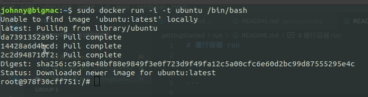
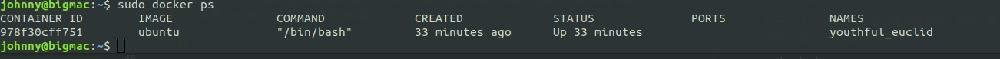

# 運行容器 run

<br>

---

<br>

啟動一個容器，指令如下：

```bash
sudo docker run -i -t ubuntu /bin/bash
```

結果：



<br>

第一次使用 docker 指令，所以分解動作一下。

* 首先，使用 docker 指令必須要有 sudoer 權限。在任何 docker 指令前必須加入 `sudo`

* `-i` 意思是讓容器 STDIN 開啟，有了它，我們就可以向容器輸入了。

* `-t` 為容器分配一個 tty 這樣一來搭配 `-i` 使用就可以提供一個交互式 shell。

* `ubuntu` 告知 docker 我們使用 __Ubuntu 鏡像__ 來建立容器。可以看到 console 結果一開始顯示說 Unable to find image 'ubuntu:latest' locally，看字面意思就知道什麼意思，找不到本地端，所以就去 docker hub 找看看有沒有，有就上去拉這個鏡像下來。

* `/bin/bash` 最後是告知容器需要運行的指令。這邊就是告知容器幫我們啟動 bash 讓我們可以輸入指令。

<br>

最後可以看到我們已經以 root 的身份進入 `978f30cff751` 容器內使用 bash 了。

<br>
<br>

接下來可以在這個容器內隨便打打看 linux 指令。基本上容器具備了一個最輕量足以執行的 linux 功能，但是他卻並不是一個真正的 OS (我所指的是像虛擬機開出來的環境)。

只要 `/bin/bash` 指令處於運行狀態時，我們的容器就一直保持運行狀態。開啟另一個 cmd 輸入以下指令查看 docker 目前正在運行的容器：

`sudo docker ps`



<br>


一旦我們輸入 `exit` 退出 bash，既指令運行結束，我們的容器也會跟停止。


<br>
<br>
<br>

---

<br>

## tips

* `sudo docker ps` 列出正在運行的容器

* `sudo docker ps -l` 列出最後一個運行的容器

* `sudo docker ps -a` 列出全部容器

<br>

---

<br>
<br>

## 為容器命名

<br>

所有的容器都會有一個獨一無二的名字，如果我們沒有在 run 鏡像的時候為容器命名，docker 會自己幫容器取名字。（像上面範例就叫做 youthful_euclid），一般情況下我們不會想讓 docker 亂幫我們命名容器。自訂容器名稱方法如下：

```bash
sudo docker run --name container_demo -i -t ubuntu /bin/bash
```

container_demo 就是此容器的名稱，啟用後可以透過 `docker ps` 查看


