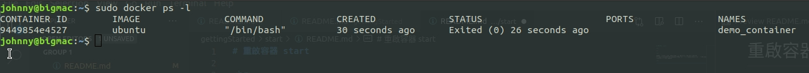
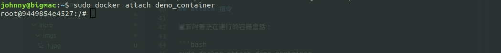

# 重啟容器 start

<br>

---

<br>

假如有一個已經停止運行的容器（接續上一章，exit 離開 bash 後容器就
停止了），我們要重啟容器的話並不是重新 run 一個鏡像。這樣只會又多建造一個容器。若想重新利用鏡像我們要使用 start 指令。

<br>

先查看一下要重啟的容器：



<br>
<br>

## `start` 指令

<br>

重啟容器我們需要有容器的名稱或者 ID，這兩個資訊都可以透過 `docker ps` 取得。

重啟容器：

```bash
sudo docker start demo_container
```

<br>

重啟之後，我們並不會直接回到指令交互界面，但事實上這個 container 重啟後會延續 docker run 所指定的命令（在這邊也就是 `/bin/bash`）。要想重新回到容器的指令交互界面，須使用 attach 指令。

<br>
<br>

## `attach` 指令

<br>

重新附著正在運行的容器會話：

```bash
sudo docker attach demo_container
```

<br>



<br>

這樣一來我們就成功重新回到容器的指令交互界面了。


