# Docker 容器間溝通

<br>
<br>

---

<br>
<br>

docker 的容器與容器之間要想進行互動溝通就必須要用以下 3 種方法：

* Docker 內部網路（ _不推薦_ ）

* Docker Networking（ _推薦_ ）

* Docker 鍊接

<br>

Docker 內部網路並不靈活好用，Docker 鍊接也已經是舊版的產物了，但是為了介紹 Docker 網路的運作概念，這邊三個方法都會介紹，但是實際使用上推薦使用 Docker Networking。

<br>
<br>

---

<br>
<br>

## Docker 內部網路

<br>

在安裝 Docker 時，會建立一個新的網卡，名字就叫做 `docker0`，在這之後每一個 Docker 容器都會在這一個網卡上分配一個 IP 位置，我們可以使用 `ip a show docker0` 來看看：

<br>

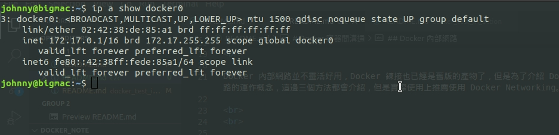

<br>

網卡 docker0 用於連接容器與主機網路，如果我們用 `ip a` 看一下，會發現一些以 veth 開頭的網卡如下：

<br>

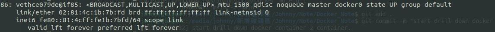

<br>

Docker 每創建一個容器就會建立一組網卡，這組網卡其中一端作為容器內的 eth0 接口，另一端就會是主機上命名類似 veth... 這種接口。而主機上的 veth 接口都是隸屬於 docker0 網卡。可以理解為 veth 接口插在 docker0 這個 bridge 上，另一端插在容器內。

<br>

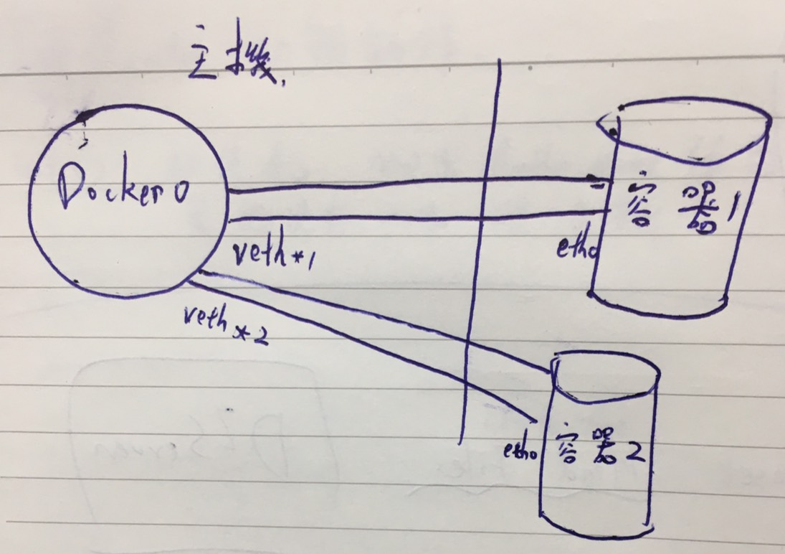

<br>

透過把每一個 veth* 街口綁定到 docker0 網卡，Docker 建立了一個虛擬子網路。這個子網路由主機與所有 Docker 容器共享。

<br>

這邊有一個例子，我預先建立好了一個容器，這個容器內運行著 nginx 服務：

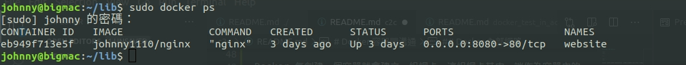

<br>

接下來我們使用 `docker exec` 進入到到容器內部並查看其 IP 位址：

<br>

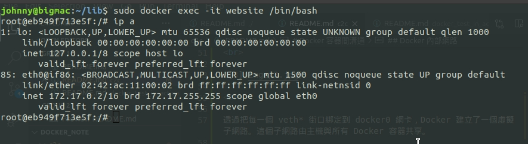

<br>

這裡可以看到容器分配到的 IP 位址為 172.17.0.2，前面使用 `docker ps` 指令看到容器內 80 port 映射主機 8080 port，所以這也意味著我們可以直接在主機上訪問 172.17.0.2:80 來訪問容器的 nginx 服務。

<br>

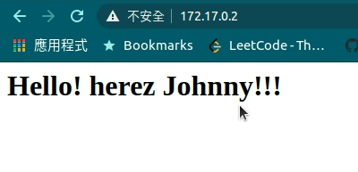

<br>

這種方式似乎可以用來作屎容器間互通的方案，但是缺點很明顯，為了要使容器間互通，我們必須要在容器內作硬編碼，舉例說就是 A B 兩ㄖ器內的應用要互通，那就要在 A 容器內設定 B 容器的 IP 位址與 port，B 容器也要如此。還有一點更為致命，就是 Docker 容器一旦重啟，IP 位址就會改變，這樣一來又要重新進入容器設定。這顯然不是一個好方法。

<br>
<br>
<br>
<br>

## __Docker Networking__ （很重要）


<br>

Docker 1.9 版本之後發布了 Docker Networking 功能，它允許使用者們建立自己的網路，容器們可以透過這個自訂網路建立連接。更加厲害的是，現在 Docker 容器甚至可以跨越不同主機來建立連接了。

<br>

這一個 part 要注意的東西有很多，稍微有點難度，看不懂就多看幾遍吧。

<br>
<br>

### 實現目標

<br>

首先先介紹一下在這一個章節我們要做什麼，我們要使用 docker 將 2 個鏡像容器化，並可以互相溝通。一個是 redis 官方鏡像，另一個是我自己用 java 寫的一個 web 服務鏡像，用於向 redis 寫入與取出資料的。

<br>

關於我寫的容器有以下幾點要說明：

<br>

* web 服務綁定到容器 4000 port。

<br>

* __存入 record 的 api__: 

    * url: /redis/set
    * method: GET
    * params:
        * key
        * value
    * return: success

<br>

* __取出 record 的 api__: 
    * url: /redis/get
        * method: GET
        * params:
            * key
        * return: value


<br>
<br>


當服務架設好後，應該要能夠：

* 開啟瀏覽器輸入 `http://localhost:4000` 就會看到歡迎頁面。

* 輸入 `http://localhost:4000/redis/set?key=test&value=123` 就可以像 redis 插入一條 record。（key=test, value=123），並回傳 success 資訊。

* 輸入 `http://localhost:4000/redis/get?key=test` 會回傳 redis 中 key=test 的資料。


<br>
<br>
<br>
<br>

### 開始實做

<br>

首先關於鏡像的部份可以先提前 pull 下來：

```bash
sudo docker pull redis
```

```
sudo docker pull johnny1110/rediswebapp
```

<br>

接下來我們來建立一個自訂的 docker network，指令如下：

```bash
sudo docker network create app
```

<br>

現在我們已經建立好一個名為 app 的 network 了，讓我來看看這個 network 裡面的細節資訊吧：

```bash
sudo docker network inspect app
```

<br>

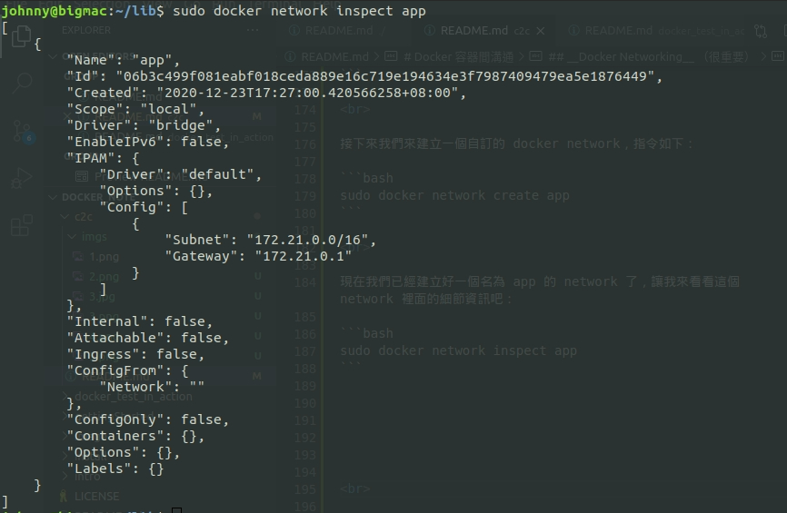

<br>

這是一個新的本地橋接（bridge）網路，而且沒有任何容器正在網路內運行。

<br>

可以使用 `docker network ls` 來查詢目前 docker 所有的 network。

<br>

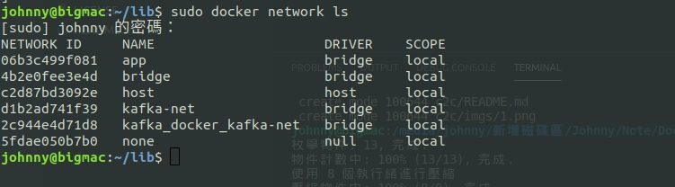

<br>

可以看到最上面名為 app 的網路就是我們剛剛建立成功的。

<br>
<br>

以上，我們已經完成了 Docker 網路的建立，接下來就是要把鏡像套用進網路了。接下來先把 redis 啟動起來：

```
sudo docker run -d --net=app --name=redis redis
```

這裡多了一個以前沒見過的參數 `--net`，這代表我們為容器指定了一個網路
，此容器啟動後會在 app 這個網路內運行。

<br>

此時我們再次使用 `sudo docker network inspect app` 的話就會有新的發現：

<br>

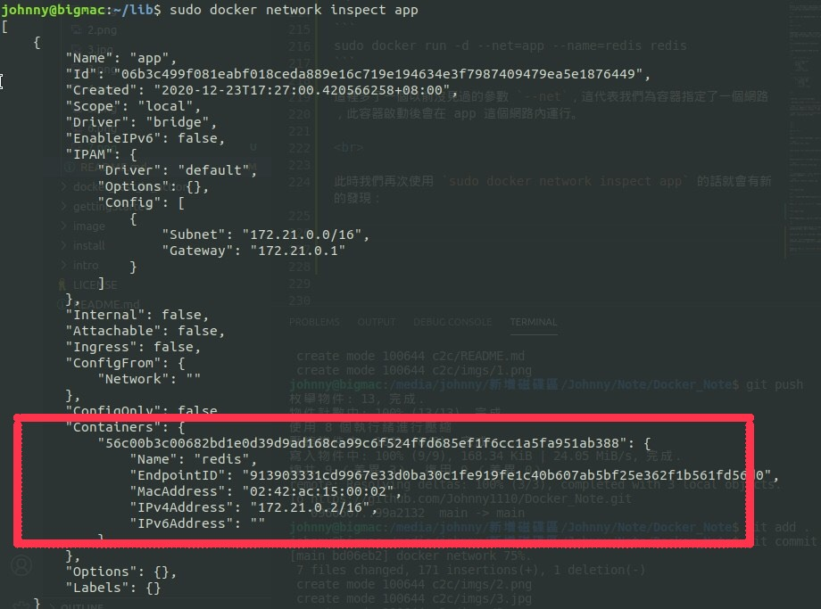

<br>

這次可以看到，app 網路的 Containers 內容多出了一個，這就是我們剛剛運行的 redis 容器。並且我們可以得知 redis 容器的 IP 位址是 `172.21.0.2`。

<br>
<br>

接下來要啟動的是前面 pull 下來的 rediswebapp 鏡像，指令如下：

<br>

```bash
sudo docker run -d -p 4000:4000 --net=app --name=rediswebapp johnny1110/rediswebapp
```

<br>

正常情況下，現在就可以連上 localhost:4000 實際操作了。但是我們對於容器內發生了什麼還是不清楚。接下來才是重頭戲，我們要進入容器來一探究竟。

<br>

首先我們再次使用 `docker netowrk inspect app` 來看一下 app 網路內部情形：

<br>

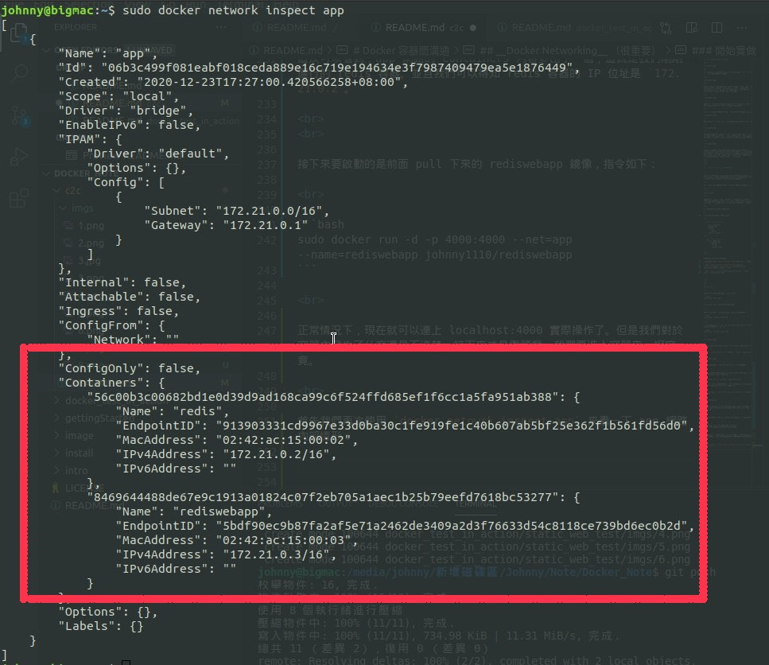

<br>

這邊留意 containers 的部份，就如我們先前所做，目前有 2 個 Container 在這個網路內，分別是 redis 與 rediswebapp。紀錄一下 2 個 Container 的 IP 位址：

* redis：`172.21.0.2`

* rediswebapp： `172.21.0.3`

<br>

現在我們使用 `docker exec` 進入到 rediswebapp 容器內：

```bash
sudo docker exec -it rediswebapp /bin/bash
```

<br>

如果沒有 ping 指令先執行這一步：

```bash
apt-get update
apt-get install iputils-ping
```

<br>

我們 ping 一下 redis 容器的 IP：

```
ping 172.21.0.2
```

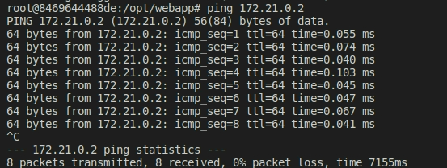

<br>

接下來我們試著 ping redis 容器名稱 或 容器ID：

```bash
ping redis
```

<br>

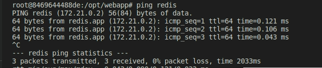

<br>

也就是說，在我們加入 Docker Networking 之後，容器的服務之間就不必在使用 IP 位址來互相溝通，可以使用容器名稱來達到目的，而且我們也不必擔心容器重啟後 IP 會改變， Docker Networking 會自動幫我們維護主機名稱與 IP 的對應表。

<br>

再來看看我寫的 web 應用關於 redis 的設定檔：

```properties
server.port= 4000

spring.redis.host=redis
spring.redis.port=6379
spring.redis.database=0
spring.redis.password=
spring.redis.jedis.pool.max-active=8
spring.redis.jedis.pool.max-wait=-1
spring.redis.jedis.pool.max-idle=8
spring.redis.jedis.pool.min-idle=0
```

<br>

可以看到我把 redis 的 host 直接設定成 redis 容器名稱。

<br>

我們也可以把現有的容器添加到 Docker 網路內：

```bash
sudo docker network connect <網路名稱> <容器名稱>
```

<br>

當然也有把容器從網路移除的指令：

```bash
sudo docker network disconnect <網路名稱> <容器名稱>
```


<br>
<br>
<br>
<br>

## Docker 鏈接 （`link`）

<br>

這個方法只推薦在 Docker 1.9 版本之前使用，後面的版本已經有更好的方案（Docker Networking），所以不要在用 link 了。

這裡示範沿用上面 Docker Networking 的範例，如果要跟著實做的話，輕先把 redis 與 rediswebapp 這兩個容器刪掉。

<br>

首先我們把 redis 容器啟動，並沒有什麼要特別注意的地方：

```bash
sudo docker run -d --name=redis redis
```

<br>

好了，接下來開始啟動 rediswebapp 容器：

```bash
sudo docker run -d -p 4000:4000 --name=rediswebapp --link=redis:db johnny1110/rediswebapp
```

<br>

這裡的指令多了一個 `--link` 之前沒有提到過，這就是容器鍊接。

`--link` 需要 2 個參數，一個是要鍊接的容器名稱，另一個是鍊接的別名。就拿這個範例來說，redis 是鍊接的目標容器，db 是此鍊接的別名。

別命的用處可以當作 host name 來使用，此時我們用 `docker exec` 進入 rediswebapp 內部，就可以使用 redis 容器名稱，IP 位址，link 別名，容器 ID 來進行連接。可以實際使用 ping 來實驗。

<br>

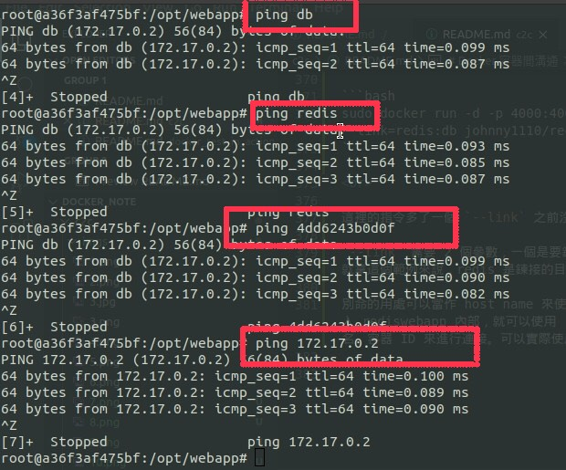

<br>

實際上 `link` 的原理就是在 run 容器時幫我們把目標容器的一些連帶資訊寫入到 /etc/hosts 內，查看 /etc/hosts 內容：

<br>

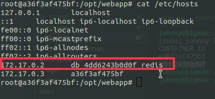

<br>

可以看到倒數第二行就有 redis 容器的相關設定，使用 `link` 做容器鍊結，即使容器重啟一樣也能正常 work。/etc/hosts 文件會自動更新 IP。

<br>
<br>
<br>
<br>

---

### tips

<br>

最後補充一個 tips。如果希望在容器啟動時，手動為容器的 /etc/hosts 添加設定可以使用 `--add-host` 參數，例如：

```bash
sudo docker run -p 4567 --add-host=docker:172.17.0.1 --name=myapp ......
```

這樣一來在這個容器的 /etc/hosts 內就會多一條我們設定的紀錄了。

