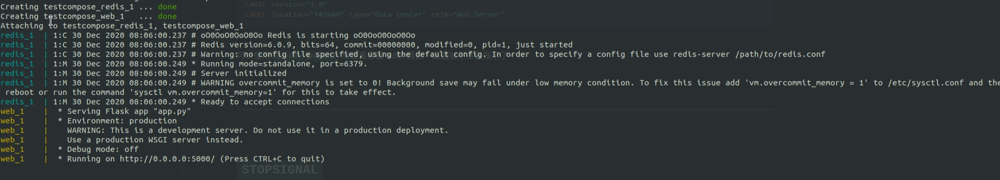
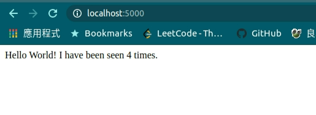
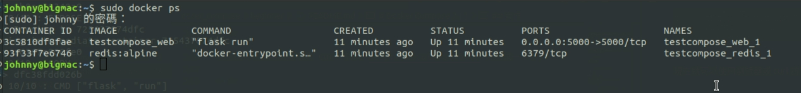
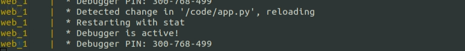

# Docker Compose 入門

<br>

---

<br>

關於入門的實做 lib 我是直接從 docker 官方文件上照搬過來的，多少會作一些刪減，如果想要完整的學習請勿必要參考[官方文件](https://docs.docker.com/compose/gettingstarted/)。

請在確實安裝好 docker 與 docker-compose 之後再進行後須操作。

<br>
<br>

## 實作

<br>

我們將使用 Docker Compose 建構一個 Python Web 應用。該應用程序使用 Flask 框架，網站功能會紀錄被訪問的次數。並使用 redis 來維護訪問次數資料。儘管範例使用 Python，不會過於難理解。

<br>

建立一個實驗資目錄：

```bash
mkdir testcompose
cd testcompose
```

<br>

建立一個 app.py 文件，並貼上以下內容：

```py
import time

import redis
from flask import Flask

app = Flask(__name__)
cache = redis.Redis(host='redis', port=6379) #1

def get_hit_count():
    retries = 5
    while True:
        try:
            return cache.incr('hits') #2
        except redis.exceptions.ConnectionError as exc:
            if retries == 0:
                raise exc
            retries -= 1
            time.sleep(0.5)

@app.route('/')
def hello():
    count = get_hit_count()
    return 'Hello World! I have been seen {} times.\n'.format(count)
```

<br>

`#1` 的部份，如果記得之前 Docker Network 章節的的，不難理解這邊直接使用 redis 的容器名稱當作 hostname。如果還是不理解，建議回去 [Docker 容器間溝通](../../c2c/README.md) 重讀一遍。


`#2` 的部份，`cache.incr('hits')` 會讓 redis 中的 key 為 hits 的資料遞增 1，並回傳目前值。

<br>
<br>

我們還需要建立一份清單，列出此 Web 的依賴套件，同樣建立在 testcompose 工作目錄下：

檔名：requirements.txt

```txt
flask
redis
```

到時候我們建構鏡像時會需要用到這個清單來 `pip install` 所需套件。

<br>
<br>

接下來建立 Dockerfile，一樣在 testcompose 目錄下：

```dockerfile
FROM python:3.7-alpine
WORKDIR /code
ENV FLASK_APP=app.py
ENV FLASK_RUN_HOST=0.0.0.0
RUN apk add --no-cache gcc musl-dev linux-headers
COPY requirements.txt requirements.txt
RUN pip install -r requirements.txt
EXPOSE 5000
COPY . .
CMD ["flask", "run"]
```

這個 Dockerfile 不會過多解釋，到目前實做階段，精通這些 Dockerfile 指令應該是最基本的需求。

<br>
<br>

接下來一樣在 testcompose 目錄下建立 docker-compose.yml 文件，注意！名稱必須一致。編輯內容如下：

```yml
version: "3.3"

services:

  web:
    build: .
    ports:
      - "5000:5000"

  redis:
    image: "redis:alpine"
```

<br>

其實 docker-compose 編寫方式不難理解，反而我認為這樣比你一個一個去起容器來的更加嚴謹安全。

我們一共啟動 2個 services（容器），分別是 `web` 與 `redis`，web 尚未被我們製作成鏡像，所以我們在 docker-compose 文件中的寫法會加入 `build` 命令。redis 是從官方 pull 下來的，所以我們可以直接使用 `image` 指令來指定鏡像以及其版本。 

<br>
<br>

在這些準備工作做好後，我們就可以正是建構並執行容器了，確保我們在 testcompose 工作目錄下，執行以下指令：

```bash
sudo docker-compose up
```

<br>

如果一切順利，將會在最後看到以下回應訊息：

<br>



<br>

現在就可以使用瀏覽器或 curl 訪問 http://localhost:5000 來測試一下了。

<br>



<br>
<br>

事實上，Docker Compose 只是替代我們手動啟用容器的一個方法，實際上底層一樣離不開 Docker，精通 Docker 的基本功對使用 Docker Compose 很有幫助。使用 `docker ps` 可以看到我們的服務理所當然的正處於 running 狀態：

<br>



<br>
<br>

現在讓我們編輯一下 docker-compose.yml 文件，加入 volume 以方便我們可以即時修改程式。

```yml 
version: "3.3"

services:

  web:
    build: .
    ports:
      - "5000:5000"
    volumes:
      - .:/code
    environment:
      FLASK_ENV: development

  redis:
    image: "redis:alpine"

```
<br>

改好就可以重新 `sudo docker-compose up`，但是在這之前記得把正在運行的容器們關掉。

<br>

重啟好之後，我們去改一下 app.py，在 return 的部份多加一點東西：

```py
return 'Hello World!!!!!!!!!!! I have been seen {} times.\n'.format(count)
```

<br>

這邊有趣的是，當我們改變了 file 並保存之後，docker 會馬上知道我們異動檔案的動作：

<br>



<br>

所以我們並不用重啟去套用修改，直接訪問服務就可以看到修改內容了。

<br>
<br>
<br>
<br>

另為，docker-compose 還有很多指令，這邊再多介紹一點，其實基本上跟普通 Docker 指令類似：

<br>

* `docker-compose up -d`  背景執行

* `docker-compose ps` 查詢啟動的容器

* `docker-compose run <服務名稱> <指令>` 這個指令允許指定一個容器一次執行你的命令，如：  `docker-compose run web env` 這個指令就可以查詢 web 容器的環境變數。

* `docker-compose stop` 停止容器

* `docker-compose down --volumes` down 是刪除容器，加上 `--volumes` 可以把 redis 內的資料一併刪除。

<br>
<br>
<br>
<br>

Docker 官方還給出了一些示例，有興趣可以參考看看：

<br>

* [如何使用Docker Compose設置和運行簡單的Django / PostgreSQL應用程序](https://docs.docker.com/compose/django/)

* [如何使用Docker Compose設置和運行Rails / PostgreSQL應用程序](https://docs.docker.com/compose/rails/)

* [如何使用Docker Compose在具有Docker容器的隔離環境中設置和運行WordPress](https://docs.docker.com/compose/wordpress/)