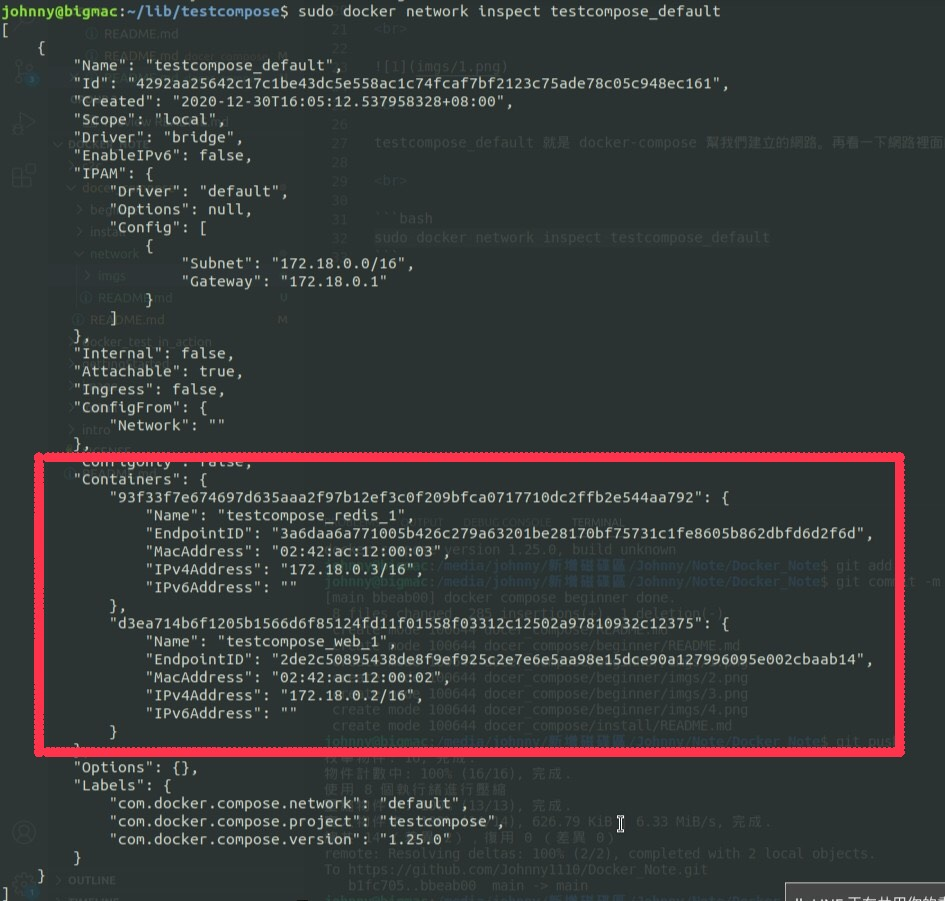
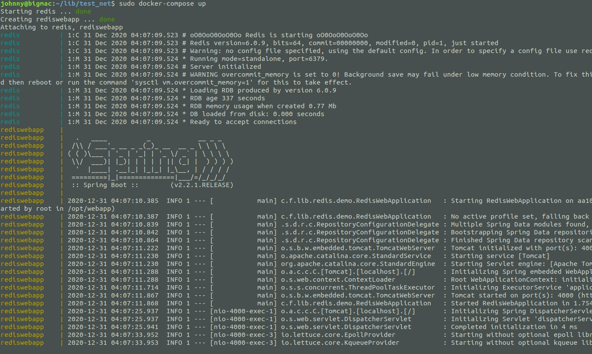

# Docker Compose 網路

<br>

---

<br>

## 預設網路

<br>

看到這邊之前，請確保已經對 Docker 容器間溝通的觀念完全了解，之後出現關於 Docker Networking 部份的基礎知識不會再重複解釋。

<br>

在上一個章節中，我們建立了一個訪問計數器系統，使用 flask 搭配 redis 實現。建構過程中有些人或許會有疑問，我們從頭到為也沒有做容器網路相關的設定，那為什麼容器間就可以正常按照我們的想法進行交互溝通呢？其實 Docker Compose 在建構服務（容器）時，會先以我們所在當千的工作目錄為名，建立一個 Docker 網路，以上一個章節為例，我們看一下現在存在的 Docker 網路：

<br>

```bash
sudo docker network ls
```

<br>


<br>

testcompose_default 就是 docker-compose 幫我們建立的網路。再看一下網路裡面的情形：

<br>

```bash
sudo docker network inspect testcompose_default
```



<br>

可以看到，docker-compose 早就自動幫我們把容器加入到這個網路中了。

<br>
<br>
<br>
<br>

## 自定網路

<br>

Docker Compose 也可以讓開發者們自行定義網路，並把容器們加入到其中。下面看一個自定網路的 docker-compose.yml 範例：

<br>

```yml
version: "3.3"

# 網路設定
networks:

  frontend:
    driver: bridge

  backend:
    driver: bridge
    # 設定 options，沒有要使用不用加。
    driver_opts:
      foo: "1"
      bar: "2"

# 服務（容器）設定
services:

  proxy:
    build: ./proxy
    ports:
      - "3000:3000"
    networks:
      - frontend

  app:
    build: ./app
    ports:
      - "8080:8080"
    networks:
      - frontend
      - backend

  db:
    image: postgres
    ports:
      - "5432:5432"
    networks:
      - backend


```

<br>

網路設定部份可以看到我們一共設定了 2 個網路，frontend 與 backend。都是使用 bridge 作為 driver。

一共有 3 個服務， proxy丶app 與 db。我們使用 2 個網路方便作前後端網路隔離，也就是說前端是無法直接訪問 db 的，一定要透過 app 也就是我們後端服務容器來間接存取 database。

proxy 服務在 frontend 網路，db 在 backend 網路，app 則存在於 2 個網路，所以他可以同時與 proxy 和 db 溝通。這就好像是 proxy 與 db 的 "傳話人"。

<br>
<br>
<br>
<br>

## 鍊接

<br>

在 Docker Compose 中我們一樣也可以使用 link 設定網路。

<br>

```yml 
version: "3"

services:

  web:
    build: .
    links:
      - "db:database"

  db:
    image: postgres
```

<br>

web 服務建立一個與 db 服務相連的鍊接，此鍊接別名為 database。

<br>
<br>
<br>
<br>

## 配置預設網路

<br>

預設網路也是可以進行設定的：

<br>

```yml
version: "3"

services:

  web:
    build: .
    ports:
      - "8000:8000"

  db:
    image: postgres

networks:
  default:
    driver: bridge
```

<br>

設定好後 Docker Compose 為我們建立的預設網路就會套用 default 的配置。

<br>
<br>
<br>
<br>

## 使用現有網路

<br>

現有網路也可以放到 Docker Compose 中使用：

<br>

```yml
networks:
  default:
    external:
      name: <現有網路名稱>
```

<br>
<br>
<br>
<br>

---

<br>
<br>

## 實作練習

<br>

在前面關於 Docker 容器溝通章節中我們使用一個 java 寫 web 應用搭配 redis 作示範，這邊使用 Docker Compose 示範一下新學到知識。

<br>

```yml
version: "3.5" # 3.5 版之後才可以自訂 network 名稱

networks:

    inet:
        name: my-inet
        driver: bridge

services:

    redis:
        image: redis
        container_name: redis
        networks:
            - inet

    rediswebapp:
        image: johnny1110/rediswebapp
        ports:
            - "4000:4000"
        container_name: rediswebapp
        depends_on:
            - "redis"
        networks:
            - inet

```

好了，設計圖紙已經畫好，接下來就是啟動他了，cd 到與 docker-compose.yml 相同路徑執行：

<br>

```bash
sudo docker-compose up
```

<br>

看到以下畫面代表執行成功：

<br>



<br>

一樣可以訪問 http://localhost:4000 測試看看。


