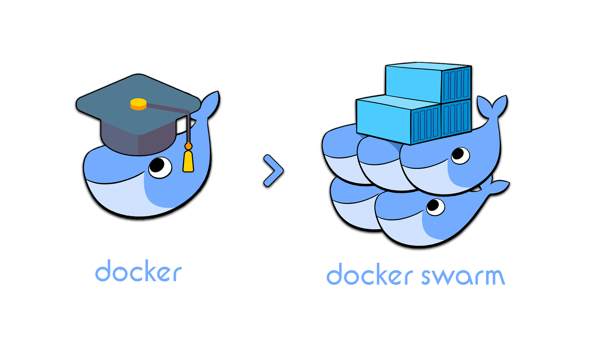
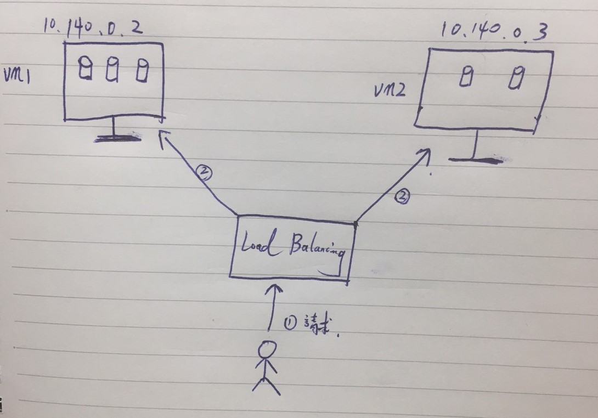

# Docker Swarm

 

---

 
 

## 簡介

 

Docker 核心三巨頭 docker-machine丶docker-compose丶 __docker-swarm__。在這個章節就來就介紹一下 __docker-swarm__。

 

要說到 docker-swarm，就要先介紹一下他有那些功能，並且能解決那些問題。

 

基本上，docker-swarm 運用場景就是在多主機群集容器，更多的功能都是基於這一點而延伸出來的。講白話一點，就是今天我們有很多主機可以用，於是就建立一個工作群組，然後選出一個工頭來管理其他主機。這也就是 swarm 字面上的意義。

 

在群集容器的基礎上，docker-swarm 又延伸了許多優秀的功能 :

 

* Scale：

    可以把一個服務分別啟動多份並平均分配給群集中的所有主機，當某一台主機發生事故或維修時，群集的其他主機會把 "罷工的工人" 的工作攬到自己身上，當然，工作重新被平均分配。整個 swarm 服務會保證 online 的服務數量至始至終都跟你交代給他的一樣。（除非所有主機一起出事）

 

* Load balancing

    前面提到了我們可以把服務啟動多份交給群其中所有 worker 執行，以下圖為例，我們把一個 web service 啟動 5 份並交給 vm1 與 vm2 運行。當使用者需要訪問我們的 web 應用時，請求會先經過 __load balancing__，再由他轉發給主機中的容器處理。事實上，當我們兩台主機都有對外的固定 IP 時，我們訪問任一台主機的 web 服務都會經過 load balance，換而言之，今天你訪問的是 10.140.0.3（vm2） 那一台主機的 80 port，實際收到這次請求並做處裡的可能是 10.140.0.2（vm1） 這一台。

    

 

* Multi-host networking

    你可以為你的服務指定 overlay network。overlay 網路主要目的就是跨主機實現容器溝通。在 overlay network 中，當初始化或更新時，swarm manager（工頭）會自動指派網路給容器，這之後會再詳細重點講解。

 
 
 
 

## 核心觀念

 

再開始實作之前，先把核心觀念搞懂會事半功倍。先看一張圖片:

 

我們先把把目光鎖定到 Manager 和 Node 們。Manager 和 Node 們都可以理解為主機，而 Manager 就是所謂 "工頭"，同時他也是有 Node 的身分，也就是說既使是個管理者同樣也可以做工作，而不是只負責管理而已。但也可以讓 Manager 只負責管理工作。

 

在 Swarm 環境中 Manager 可以有多個，但是 Leader 只能有一個。Leader （不可以被移除）。

 

使用 docker-swarm 的所有主機要保證使用的 docker-engine 版本要一致，不然可能有意想不到的 bug。

 

圖片中可以看到有 3 個 node，它們分別運行了紫色與綠色的容器，紫色的容器都是來自同一個鏡像，我們將這些稱這些容器統一稱為 service，綠色容器們也是一樣道理。在這張圖內一共有 2 個服務（service）正在被 docker-swarm 運行。

 
 
 
 

## 實作

 

* [docker-swarm 基礎操作](basic/README.md)

