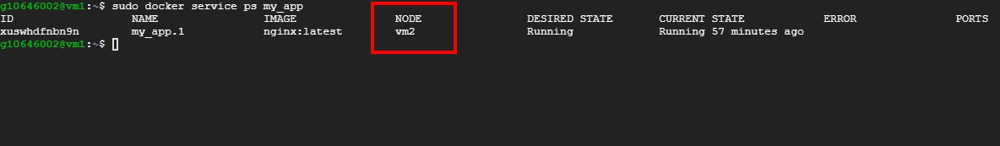

# docker-swarm 基礎操作

<br>

---

<br>
<br>

## 前置作業

<br>

docker-swarm 的實作練習需要有2台或以上的主機，使用虛擬機也可以，這裡我使用 GCP 來示範。沒有2台主機或者不能用虛擬機的可以考慮註冊 GCP，可以免費用半年。

<br>

之後關於 docker-swarm 的介紹我都會以 GCP 作為範例演示，使用虛擬機也不必擔心，都大同小異。

先開好 2 台機器，OS 盡量使用 Ubuntu 20.04：


如果你是用虛擬機的，同樣也能查到主機 ip。以下針對 ip 的操作就請替換成你自己的主機 ip。

<br>

在兩台虛擬機中分別安裝 docker，請確保版本一致，如果你是用 Ubuntu 20.04 的話執行下列命令就可以快速安裝了:

```bash
sudo apt-get update
sudo apt-get install docker docker.io
```

<br>

安裝好後檢查一下版本：


<br>

都沒問題的話，我們就可以正式開始時做 docker-swarm 了。

<br>
<br>
<br>
<br>

## 建立群集

<br>

我們選定 vm1 當作 Manager，vm2 當作 worker。所以我們先針對 vm1 做一些設定：

<br>

```bash
sudo docker swarm init --advertise-addr 10.140.0.2
```

我們初始化設定了 vm1 為 leader 同時為 manager（記得這邊 ip 換你自己的 vm1 子網 ip）

<br>

如果不出意外的話應該會看到這個畫面：

<br>


<br>

這裡一共給我們 2 個資訊，一是現在這個 node （vm1）已經是 swarm 的管理者了，第二個是如果要把其他 node 加入到這個 swarm 中作為 worker 只要輸這個指令：

<br>

```bash
docker swarm join --token SWMTKN-1-3hzht65p6a1nhl2oj9qn2yel1899xkzdzxcw4xu4847wchju5e-6wd5ppdiegwgp8jrm7q0or1h5 10.140.0.2:2377
```

<br>

這個指令不用抄，如果忘記了就叫 docker 再顯示一次就好：

<br>

```bash
sudo docker swarm join-token worker
```

<br>


<br>

如果想把其他 node 以 manager 的身分加入到 swarm 稍微改一下查詢指令就可以了：

<br>

```bash
sudo docker swarm join-token manager
```

<br>

現在就來把 vm2 加入到 swarm 中吧，切到 vm2 的 shell 介面，直接貼上剛剛的 swarm join 指令：


再次提醒要注意我們是要在 vm2 做喔!!!現在已經成功把 vm2 加入到 swarm 了。

<br>

現在讓我們回到 vm1 去確認一下目前 swarm 狀態。

<br>

```bash
sudo docker ndoe ls
```

<br>


<br>

這裡不多做解釋了，應該都看得懂意思。如果你在 vm2 上執行這個指令會失敗，因為針對 swarm 做任何操作只有 manager 才有權進行，vm2 只是 work，所以它只要負責做事就好了，並不需要知道 swarm 名單以及對 swarm 進行操作。

<br>
<br>
<br>
<br>

## 離開 Swarm / 刪除 Node

<br>

如果要把 vm2 從 swarm 中移除，必須要讓 vm2 的 status 處於 down 得狀態，怎麼做呢 ? 可以直接把 vm2 關機，或者 vm2 主動離開 swarm：

<br>


在 vm2 中執行
```bash
sudo docker swarm leave
```

無論用哪一個方法，我們回到 vm1 再次查看都會發現 vm2 已經處於 down 的狀態了（ps 可能要等一下才會看到）：

<br>


現在就可以刪除它了：

```bash
sudo docker node rm vm2
```

<br>

如果今天要刪除的是一個 manager node，我們也不能直接把它刪除，正確作法是先將它 demote 成 worker，然後再用刪除 worker 的方法把它刪除。

<br>

假如 vm3 是一個 manager，我們要先 demote 它：

<br>

```bash
sudo docker node demote vm3
```

<br>

然後再刪除：

```bash
sudo docker node rm vm3
```

<br>

或許這個時候你會想 `rm` 一下 vm1 試試看，它會告訴你不可以移除最後一個 manager，確實，我們只指定了一個 manager，解決方法就是直接 `docker swarm leave` 就好了，記得要加 `--force` :

<br>

```bash
sudo docker swarm leave --force
```

<br>
<br>
<br>
<br>

## 部屬服務

<br>

在實作部屬服務之前，如果在上一小節你已經把 node 刪光了請把它們重新復原回來（重做一次）。

<br>

如果我們要對 Swarm 部屬服務，一定要在 manager node 上操作，在這個範例中 manager 是 vm1，所以我們先來到 vm1 中。輸入指令：

<br>

```bash
sudo docker service create --name=my_app -p 8080:80 nginx
```

<br>

相信有 docker 基礎的人應該都看得懂這些參數的作用，要注意的是最後一個參數是指定鏡像名稱，這裡我們用的是 nginx。

<br>

啟動好後順便用 `docker service ls` 檢查看看是否成功啟動：

<br>


<br>

這個時候，你已經成功部屬了一個服務在 swarm 中。看到上圖，你會發現一個 `replicas` （複製品）的欄位。記得前面說的 scale 嗎？這邊我們的服務只有啟動一個，並沒有其他複製品，想要知道這個服務到底是起在　vm1 還是 vm2 可以輸入以下指令：

<br>

```bash
sudo docker service ps my_app
```

<br>

這個指令可以查詢 `my_app` 服務的狀態，回應如下：

<br>



由此可知，這一個服務單體在 vm2 上被運行，事實上，如果這個時候在 vm2 輸入 `docker ps` 是可以看得到是有 process 在執行的：

<br>


<br>

前面提到了 swarm 有 load balancing 的功能。現在我們已知服務單體是被啟動並運行在 vm2 中。我們可以在 vm1 中訪問一下 http://localhost:8080 ，你會發現是可以連到 nginx 的，相同的 vm2 也是可以，這邊我用 `curl` 示範：

<br>


<br>

即使服務只啟動一份並放在 vm2 上，我們還是可以通過 swarm 中其他的 node 來訪問這個服務。（我們訪問 vm1 的 8080 port，請求會被 load balancing 轉送到 vm2 去）

<br>
<br>
<br>
<br>

## Scale

<br>

前面我們建立了一個服務，但是只建立了一個單體，現在我們想要把這個服務多複製幾份，然後部屬到所有 node 中去。基於前面服務的基礎，我們可以直接以更新的方式來增加複製品：

<br>

```bash
sudo docker service scale my_app=5
```
<br>

這樣一來在原有的單個服務基礎上，Swarm 會幫我們再增加 4 個 `my_app` 複製品，並分派到所有 node 中：

<br>


<br>

此時我們再次查看 `my_app` 服務的狀態，使用 `docker service ps my_app`：

<br>


<br>

可以看到服務被複製了一共 5 份，並分配給了 vm1 與 vm2 執行。

<br>

其實也可以在一開始建立服務的時候就指定 scale 數量：

<br>

```bash
sudo docker service create --name=my_app2 --replicas=10 -p 80:80 nginx
```
<br>


<br>

如果我們想要調整 replicas 的數量，可以使用 `docker service scale` 來隨時調整

<br>

```bash
sudo docker service scale my_app2=5
```

<br>

此時的 `my_app2` 服務複製品數量應該降到只會有 5 個了。可以使用 `docker service ps my_app2` 檢查一下，這邊就不做演示了。

<br>

如果在服務上線後，還想對服務做出一些修改可以使用 `update` 指令。例如我們想多增開一個對外 port，我們可以這樣做：

<br>

```bash
sudo docker service update --publish-add 7371 my_app2
```

<br>


<br>

還有更多的可供 `update` 屬性可以使用 `--help` 參數查詢，這邊就不一一介紹了。  

<br>
<br>
<br>
<br>

## Node 維護 / 重新上線

<br>

當我們需要對部分伺服器維護的時候，我們可以更新 Node 的可用狀態，先來看看我們的服務目前狀態，使用 `docker service ps my_app`：

<br>


<br>

一共啟動了 10 個複製（如果你不是 10 個就請用 `docker service scale` 自行添加），他們被平均分配到 vm1 與 vm2 中。現在我們要讓 vm2 離線去維護，首先我們就要更新 node 的狀態，使用以下指令：

<br>

```
sudo docker node update --availability drain vm2
```

<br>

這個指令會使 vm2 的 availability 狀態變成 Drain，我們使用 `docker node ls` 看一下：

<br>


<br>

然後我們再看看服務的狀態如何，`docker service ps my_app`：

<br>


<br>

這邊可能要仔細看一下了，在 vm2 上的服務複製品全部 shutdown 了，並且移轉給 vm1 運行，swarm 永遠保持了你一開始跟她提出的 `replicas` 需求，現在我們就可以放心的去對 vm2 維護了。

<br>

如果維護結束，我們可以再次把 vm2 的狀態改成 active，讓它重新上線：

<br>

```
sudo docker node update --availability active vm2
```

<br>

但是有一點要注意，雖然我們讓 vm2 重新開張營業，但是並不代表 vm1 會把之前攬過來的工作還給 vm2，此時的 vm2 只能接受 manager 新派發的任務。這一點倒是不夠靈活。

<br>
<br>
<br>
<br>

## 最後補充

<br>

關於 docker swarm 還有一點要補充的，也算是蠻可惜的，如果今天 Swarm 中的一個 node 意外關機了，我們在 manager node 上使用 `docker node ls` 是可以發現 work 的狀態會從原本的 `active` 變成 `down`。但是不要以為重啟 node 之後，它會自動變回 active，docker swarm 沒有這麼聰明，如果 node 關機了，那唯一能把 node 重新啟用的方法就是讓 node 先離開 Swarm，在重新加入 Swarm。這就非常白癡，希望未來的版本 docker 可以把這個問題解決。