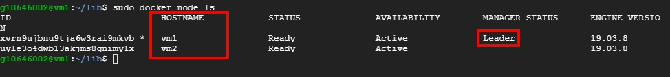

# docker swarm 部屬 Spring Boot + redis

<br>

---

<br>

在經過這一個章節之後，基本上就已經對 docker-swarm 有一定的基本了解了，這個章節就來實戰演練一下，除原有的基礎知識外，本章還會繼續學到 docker-stack 用法。

<br>

在談到 docker 容器互通章節時，我們使用過一個 Web 應用範例，這裡我們一樣沿用，再次敘述一下這個應用的功能以及我們要如何使用 docker-swarm 來部署它。

這個應用是一個簡單的 Web API 應用，使用 java spring-boot 編寫，串接了 redis，使用 Web API 的方式對 redis 新增/查詢資料。另外，此應用依賴於 redis，所以我們需要搭配 redis 鏡像來部屬。

<br>

鏡像的部分可以提前先 pull 下來（這一步也可以不用做，因為 docker stack 會自動 pull）：

<br>

```bash
sudo docker pull johnny1110/rediswebapp
sudo docker pull redis
```

<br>

這個 web 服務的對外 port 使用 4000，我們需要記得對外開放 4000 port，redis 服務只有在 docker 網路內會被 rediswebapp 使用，所以並不需要對外公開 port，同時也起到保護作用。

<br>

好了，現在交代一下我們的部屬條件，我們需要把 redis 服務部屬在 manager 機器上（vm1），rediswebapp 平均部屬 10 個複製品到所有 node 中（vm1 與 vm2）。

<br>
<br>
<br>
<br>

## docker-compose.yml

<br>

我們要先編寫一份 docker-compose.yml 檔案，需要注意的地方我都以註解方式說明：

<br>

```yml
version: "3.5" # 3.5 版之後才可以自訂 network 名稱

networks:

    inet:
        name: my-inet
        driver: overlay # docker-swarm 專屬網路驅動

services:

    redis:
        image: redis
        networks:
            - inet
        deploy: # docker stack 指令 
            restart_policy:
                condition: any # 在任何情況下嘗試重啟
            placement:
                constraints: [node.role == manager]  # 確保此服務會被部屬在 manager 上

    rediswebapp:
        image: johnny1110/rediswebapp
        ports:
            - "4000:4000"
        depends_on:
            - redis
        networks:
            - inet

        deploy:
            replicas: 10 # 啟動 10 個複製品
            update_config:
                parallelism: 2 # 一次平行更新 2 個
            restart_policy:
                condition: any # 在任何情況下嘗試重啟
```

<br>
<br>
<br>
<br>

## 開始部屬

<br>

先確認一下我們的 swarm 架構，輸入 `docker node ls`：

<br>



<br>

開始進行部屬，輸入以下指令：

```
sudo docker stack deploy -c docker-compose.yml redis_web
```

<br>

看到以下畫面代表部屬順利進行：

<br>


<br>

來查詢一下目前服務部屬狀況，使用 `docker service ls`：

<br>


<br>

觀察 replicas 與 ports 都如我們預期的順利部屬好了。現在就可以測試看看了，可以使用瀏覽器訪問看看任一台 vm 的 4000 port 服務。

<br>


<br>

因為我使用的是 GCP，所以我是直接連虛擬機的對外 IP，如果你在本地端使用 vm，可以直接訪問虛擬機的 IP。

<br>

再來實驗看看能不能存取 redis 資料：

<br>

寫入資料：

http://vm1的IP/set?key=1&value=hello


<br>

讀出資料：

http://vm1的IP/get?key=1


<br>

以上我們就已經成功部屬好了這個應用場景。


<br>
<br>
<br>
<br>

## 細節探討

<br>

第一次使用 docker stack 來部屬 swarm 可能你會一頭霧水，這邊就來解析一下我們都做了甚麼。

<br>
<br>

### 網路

<br>

首先需要聊解的就是網路部分，我們網路選擇使用 overlay 網路，這種網路專門用於容器跨主機溝通的場景，通常都是搭配 swarm 使用。我們先看看這個 overlay 網路的具體信息：

```
sudo docker network inspect my-inet
```

```json
[
    {
        "Name": "my-inet",
        "Id": "bp4nujl7o40kh7b2prpvmxory",
        "Created": "2021-01-19T02:06:31.714564537Z",
        "Scope": "swarm",
        "Driver": "overlay",
        "EnableIPv6": false,
        "IPAM": {
            "Driver": "default",
            "Options": null,
            "Config": [
                {
                    "Subnet": "10.0.1.0/24",
                    "Gateway": "10.0.1.1"
                }
            ]
        },
        "Internal": false,
        "Attachable": false,
        "Ingress": false,
        "ConfigFrom": {
            "Network": ""
        },
        "ConfigOnly": false,
        "Containers": {
            ......
            ......
            ......
            },
        "Options": {
            "com.docker.network.driver.overlay.vxlanid_list": "4097"
        },
        "Labels": {
            "com.docker.stack.namespace": "redis_web"
        },
        "Peers": [
            {
                "Name": "b7ec99d227ef",
                "IP": "10.140.0.2"
            },
            {
                "Name": "8dc4c4a0acca",
                "IP": "10.140.0.3"
            }
        ]
    }
]
```

<br>

看到結尾處的 `Peers` 參數，vm1 與 vm2 的 IP 都被設定到這個網路中。這個名為 `my-inet` 的網路是我們在 docker-compose.yml 中設定的，無論在 vm1 或 vm2 上你都會發現這個網路設定，在這個網路中允需我們的所有容器使用 service name 作為域名來互相訪問，接下來就來實驗看看：

<br>

我們先查好 redis 在 `my-inet` 網路中的設定：

<br>

你的 redis 被分配到的 IP 應該跟我是不一樣的，這邊還是要用 `docker network inspect my-inet` 來親自查看一下：

<br>

```json
"3548a13b5cdedc079959ee226d1c64c17257ffbfb630f20b1dbd0eef23171079": {
                "Name": "redis_web_redis.1.lq6pgs04kw30ikz73nz78tn4c",
                "EndpointID": "e1a93948c40d8d39f6c71df66b71199b9387715b5517021680c3e2b93fc03118",
                "MacAddress": "02:42:0a:00:01:1d",
                "IPv4Address": "10.0.1.29/24",
                "IPv6Address": ""
            },
```

<br>

這邊紀錄一下 redis 服務被分配到的 IP 是 10.0.1.29。

<br>

現在我們隨便 `docker exec` 到一個 rediswebapp 複製品中：

<br>


<br>

先安裝一下 ping 工具：

```bash
apt-get install iputils-ping
```

<br>

接下來直接 ping redis（redis 服務在 docker-compose.yml 中就被我們命名為 redis） ：

```bash
ping redis
```

<br>


<br>

這個時候你會發現一個奇怪的事情，明明 redis 服務 IP 是 `10.0.1.29`，這邊 ping redis 為甚麼是訪問 `10.0.1.15` 呢？

其實 docker 當然是不可能直接把 redis 域名直接映射成他實際 IP，試想一下如果有 2 個 redis 複製品那究竟該映射誰呢？我們可以理解 redis 這個域名被綁定（映射）到一個 load balancing 服務上，這個 load balancing 會幫我們把請求封包發配給實際 redis 服務，而這個 load balancing IP 就是 10.0.1.15。我們　ping 到的其實是 redis 的 load balancing 服務

同理，我們也可以 ping 一下 rediswebapp：

<br>


<br>

這個時候你可以去 vm1 與 vm2 的 network 上去找，你一定找不到 IP 為 `10.0.1.2` 的 rediswebapp 服務。因為這個 IP 是 rediswebapp 的 load balancing 服務。

<br>

接下來你可以試試看在 vm2 的任一一個 rediswebapp 容器內 ping vm1 的任一一個容器，可以 ping IP，也可以 ping 容器名稱，你會發現都是可以互通的，所以也並不是一定要依賴 load balancing 服務來幫助我們實現容器通信。

<br>
<br>
<br>
<br>

## 問題

<br>

在 rediswebapp 服務中連線 redis 服務的 url 為何？

<br>

答案：

<font color="white">redis:6379<font>


