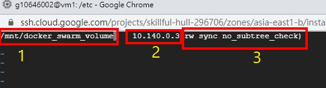
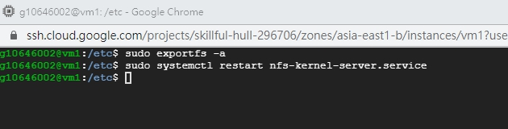
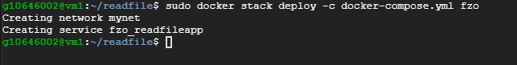
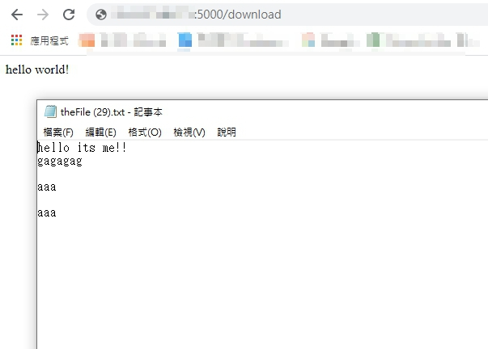

# Docker Swarm 使用 volume

<br>

---

<br>

上一個章節提到的建構 Docker Swarm 服務其實存在一個問題。因為我們訪問這個 Swarm 內的每一個 Node 都會被 load balancing 重導向到隨機一個容器，所以這就表示說，我們的訪問必須是無狀態的（不帶 session 等等）。再說的白話一點，因為我們每次實際訪問到容器都不同，所以如果我們需要保存 2 次訪問服務前後的某些資料，以前面的架構是不可能實現的。接下來就來解決一下這個問題。

<br>

如果你想到使用 `volume` 解決那基本上已經答對一半了。事實上我們確實是使用 volume 來使容器間共用資料，但是還需要解決一個問題，就是如果今天服務複製品被分布在 2 台主機上，那要如何讓這兩台機器共享 volume。

<br>
<br>
<br>
<br>

## 部屬 NFS 伺服器與客戶端

<br>

這邊只是提供一個解決方案－使用 NFS，事實上也可以使用其他檔案共享軟體，這邊不會全部討論。

<br>

整理一下我們目前的部屬架構，我們一共有 2 台虛擬機，他們的 IP 位置如下：

<br>


<br>

vm1 是我們的 Manager，vm2 是 Worker。我們需要在 vm1 上部屬 NFS 伺服器，vm2 上部屬 NFS 客戶端。也就是所有 volume 實際的存放處是在 vm1 上。

<br>

我們先把 vm1 上的工作做完，第一件事先下載 nfs-server。（我們使用 ubuntu 20.04 OS 版本）

<br>

```bash
sudo apt install nfs-kernel-server
```

<br>

接下來建立一個目錄，這個目錄是作為共享資料夾使用：

<br>

```bash
sudo mkdir -p /mnt/docker_swarm_volume
```

<br>

這個資料夾我們要把它權限全開，不然到時候 client 端會被拒絕存取。

<br>

```bash
sudo chown nobody:nogroup /mnt/docker_swarm_volume
```

```bash
sudo chmod 777 /mnt/docker_swarm_volume
```

<br>

檢查一下這個資料夾的權限以及所有權更改狀況：


<br>

接下來我們需要改變一下 nfs 的設定檔：

<br>

```bash
sudo vim /etc/exports
```

<br>

輸入內容：

```
/mnt/docker_swarm_volume    10.140.0.3(rw,sync,no_subtree_check)
```

<br>



<br>

第一個部分 `/mnt/docker_swarm_volume` 就是我們需要共享的資料夾。

第二個部分 `10.140.0.3` 是 vm2 的 IP 位置，如果有任何裝置要加入分享這個資料夾，就要在這邊加入允許存取的來源 IP。

第三故部分 `(rw,sync,no_subtree_check)`，`rw` 允許來源裝置讀寫操作，`sync` 啟用同步，代表資料會同步寫入到記憶體與硬碟中，`no_subtree_check` 停用 subtree 的檢查，選取停用 subtree 的檢查將可增加傳輸速率。

<br>

關於 nfs 的設定檔參數可以參考下面這張表：


（[資料來源取用自鳥哥的 Linux 私房菜](http://linux.vbird.org/linux_server/0330nfs.php#nfsserver_exports)）

<br>

當然，如果想要讓一整個子網域中的主機都共享檔案服務可以這樣設定：

```
/mnt/docker_swarm_volume 子網IP/16(rw,sync,no_subtree_check)
```

<br>

接下來要導出工想目錄：

<br>

```bash
sudo exportfs -a
```

<br>

重啟 nfs-server：

```bash
sudo systemctl restart nfs-kernel-server.service
```

<br>



<br>

以上，我們對 nfs-server 的部分已經設定完成了，記得如果防火牆有開啟要去設定一下，允許來源 IP 的訪問。如果沒有開啟防火牆就不用管了。

<br>
<br>

接下來要對 vm2（worker）進行設定。首先我們要在 vm2 上安裝 nfs-client：

<br>

```bash
sudo apt-get install nfs-common
```

<br>

安裝好後，我們要在 vm2 也建立一個資料夾，同 vm1 中的路徑一致：`/mnt/docker_swarm_volume`。同時我們也需要對這個資料夾權限全開：

<br>

```bash
sudo mkdir -p /mnt/docker_swarm_volume
```

```bash
sudo chmod 777 /mnt/docker_swarm_volume
```

<br>

接下來，我們直接在 vm2 上掛載 vm1 的共享資料夾。

<br>

```bash
sudo mount 10.140.0.2:/mnt/docker_swarm_volume /mnt/docker_swarm_volume
```

<br>

我們把 vm1 的 `/mnt/docker_swarm_volume` 資料夾掛到了 vm2 上。這樣這樣大功告成了。可以實驗一下在 vm2 的共享資料夾內建立一個檔案，回到 vm1 去看一下是否同時出現。完成以上工作之後，我們就可以進行下一步了。

<br>
<br>
<br>
<br>

## 部屬測試服務

<br>

我寫了一個簡單的範例程式，可以下載檔案。當然，這個檔案是存放在共享資料夾中的，同時也會作為服務複製品們的共享 volume。

服務我已經包成鏡像上傳到 docker hub 了，可以事先 pull 下來：

<br>

```bash
sudo docker pull johnny1110/readfileapp
```

<br>

直接建立 [docker-compose.yml](docker-compose.yml)：

```yml
version: "3.5" # 3.5 版之後才可以自訂 network 名稱

networks:
  mynet:
    name: mynet
    driver: overlay # docker-swarm 專屬網路驅動

services:
  
  readfileapp:
    image: johnny1110/readfileapp
    ports:
      - "5000:5000"
    networks:
      - mynet
    volumes:
      - /mnt/docker_swarm_volume/:/tmp/webapp/data/
    deploy:
      replicas: 2 # 啟動 2 個複製品
      update_config:
        parallelism: 2 # 一次平行更新 2 個
      restart_policy:
        condition: any # 在任何情況下嘗試重啟
```

<br>

readfileapp 這個服務只提供一個主要功能，當被訪問 `/download` 這個 url 時會回傳容器中 `/tmp/webapp/data/` 的 test.txt 文件。而這個路徑被我們掛載到他們各自的宿主機上的 `/mnt/docker_swarm_volume/` 資料夾。

<br>

這個 yml 檔只有 readfileapp 服務的 volume 要注意，我們把容器的 `/tmp/webapp/data/` 資料夾掛到主機上的共享資料夾。

<br>

現在就來部屬這個服務吧。`cd` 到 docker-compose.yml 所在資料夾，執行以下指令：

<br>

```bash
sudo docker stack deploy -c docker-compose.yml fzo
```

<br>



<br>

部屬好後，直接來測試看看開啟瀏覽器訪問以下路徑：http://vm的IP:5000/download ，容器會直接回應你一個 txt 檔案，這個檔案被放在主機上的 `/mnt/docker_swarm_volume` 資料夾名為 __test.txt__，我們可以在 vm1 或 vm2 上的任意一台上改變這個檔案的內容。再次下載看看，內容會變得不一樣。

<br>



<br>

