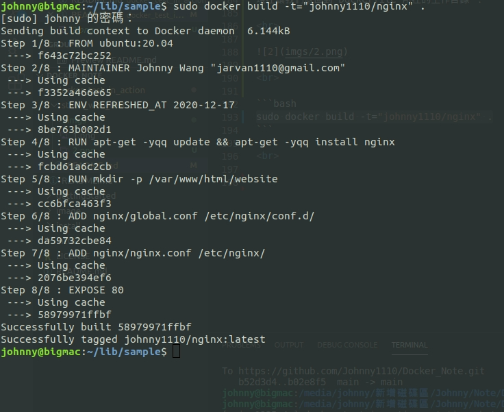
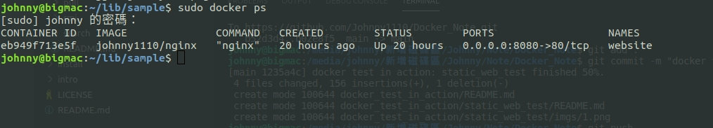
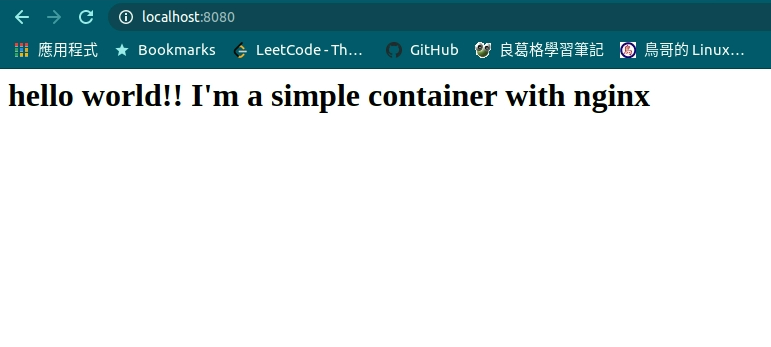
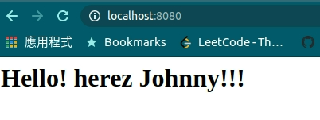

# 靜態網頁測試

<br>

---

<br>

這是一個簡單的靜態網站測試範例，一般來說作為開發者想要測試靜態網頁能否基本就是以 chrome 開啟，少數有關 js 的套件或方法需要我們將網頁部屬在 localhost 上（例如　vuex丶vue-router）。

<br>

node.js 前端開發者習慣使用 webpack 來即時預覽協助自己編寫端，但是並不能即時模擬生產環境狀況。舉 __vue-cli__ 來說，編寫前端的時候會分出很多個部件 js 檔，編譯出結果後回得到 index.html 與 main.js 兩個檔案。我們可以在真正部屬上 server 之前，在本機上先部屬測試看看，確認沒問題之後甚至不用在 server 上建制環境，只要把我們測試好的 docker image 搬上 server 執行。

<br>

在本次範例中，並不會真的去弄 vue-cli 來示範，我們就簡單的用一個 index.html 來示範。

<br>
<br>

## 事前準備

<br>

在開始之前請跟著以下步驟建構當前工作目錄：

```bash
mkdir sample
cd sample
mkdir nginx
mkdir website
touch Dockerfile
```

<br>

建立好基本工作目錄後，在 GUI 模式下我們應該會看到：


<br>

在 nginx 資料夾中，我們要放置關於 nginx 的設定檔，website 資料夾則是放置我們的靜態頁面。

<br>
<br>

---

<br>
<br>

## Nginx 設定檔

<br>

進入 nginx 資料夾，在這邊我們需要放入 2 個檔案：

<br>

* global.conf：

    ```
    server {
            listen          0.0.0.0:80;
            server_name     _;

            root            /var/www/html/website;
            index           index.html index.htm;

            access_log      /var/log/nginx/default_access.log;
            error_log       /var/log/nginx/default_error.log;
    }
    ```

    如果有使用過 nginx 的經驗就不用看我囉唆了，這邊要注意的點是 root 參數的值，這意味著待會容器內的 nginx 會以 `/var/www/html/website` 當作 root 目錄，其他沒什麼好說的。

<br>

* nginx.conf：

    ```
    user www-data;
    worker_processes 4;
    pid /run/nginx.pid;
    daemon off;

    events {  }

    http {
        sendfile on;
        tcp_nopush on;
        tcp_nodelay on;
        keepalive_timeout 65;
        types_hash_max_size 2048;
        include /etc/nginx/mime.types;
        default_type application/octet-stream;
        access_log /var/log/nginx/access.log;
        error_log /var/log/nginx/error.log;
        gzip on;
        gzip_disable "msie6";
        include /etc/nginx/conf.d/*.conf;
    }
    ```

    第四行有一個 `daemon off`，這意味著我們啟動 nginx 時不必在手動添加 `-g "daemon off;"` 指令了。 

    nginx 主要還是要看 nginx.conf 的設定為主，我們的 global.conf 就被 nginx.conf 包括進來了 `include /etc/nginx/conf.d/*.conf;`


<br>
<br>

---

<br>
<br>

## 靜態文件

<br>

進入 website 資料夾內，建立所需的靜態文件：

<br>

index.html：

```html
<h1>hello world!! I'm a simple container with nginx</h1>
```

<br>
<br>

---

<br>
<br>

## 編寫 Dockerfile

<br>

上面準備工作做好之後，接下來就是要開始編寫 Dockerfile 了：

```dockerfile
FROM ubuntu:20.04
MAINTAINER Johnny Wang "jarvan1110@gmail.com"
ENV REFRESHED_AT 2020-12-17
# 更新 apt-get, 安裝 nginx
RUN apt-get -yqq update && apt-get -yqq install nginx
# 建立用來存放靜態文件的資料夾
RUN mkdir -p /var/www/html/website
# 將 nginx 設定檔加入到鏡像中
ADD nginx/global.conf /etc/nginx/conf.d/
ADD nginx/nginx.conf /etc/nginx/
# 對外開放 80 port
EXPOSE 80
```

隨然有寫註解，但是還是多囉唆一點， `apt-get` 之前的部份就不講了，在那之後首先要建立 `website` 資料夾，之後會用於註冊成 volume。然後將之前放置在 `/nginx` 資料夾內的設定檔加入到鏡像中。

<br>
<br>


以上就是所有的文件編寫準備工作，接下來開始正是建造鏡像跟部屬工作。

<br>
<br>

---

<br>
<br>

## 建構鏡像

<br>

現在讓我們退回到 Dockerfile 所在的工作目錄 ：

<br>


<br>

```bash
sudo docker build -t="johnny1110/nginx" .
```

<br>



<br>
<br>

---

<br>
<br>

## 運行鏡像

<br>
<br>

```bash
sudo docker run -d -p 8080:80 --name website -v $PWD/website:/var/www/html/website johnny1110/nginx nginx
```

<br>

這一行指令還是有必要再解釋一下的，雖然在之前都已經分別詳細解釋過用法了。

* `-d` 告知 docker 背景運行這個容器。

* `-p 8080:80` 容器內 80 port 綁定到主機 8080 port。

* `--name` 指定容器名稱。

* `-v <主機 volume 位置>:<容器 volume 位置>` 指定 volume，關於 volume 正詳細的資訊可以參考這裡 [任意門](../../image/dockerfile_cmd/README.md)。

* `johnny1110/nginx` 是要運行的鏡像名稱。

* `nginx` 容器要執行的命令。

<br>
<br>

容器啟動之後，使用 `docker ps` 來查看一下目前正在運行中的 container。

<br>



<br>

一切正常，就讓我們開啟瀏覽器輸入 `localhost:8080` 試試看：



<br>

以上就完成了我們對 nginx 靜態網站測試環境建置。接下來我們可以把 `website` 裡面的 `index.html`
 改一下試試看，回去重整頁面的話，畫面會立即更新。

 <br>

 ```html
<h1>Hello! herez Johnny!!!</h1>
 ```

