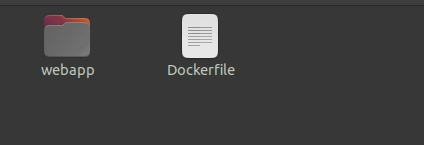
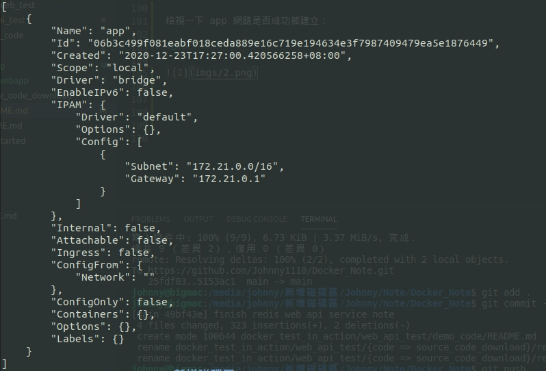
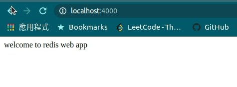
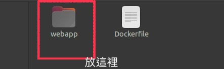
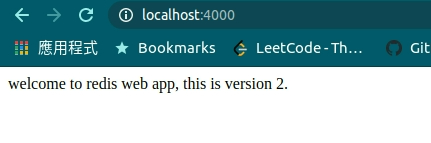

# Web API service 測試

<br>

---

<br>

在前面關於 Docker Networking 中展示了一個 rediswebapp 鏡像範例，這邊就以 rediswebapp 為範例，我們來示範一下如何測試 Web API service。

<br>

這個小程式對於 java 工程師們來說理解起來分常簡單，使用 Spring Boot 搭配 redis 搭建一個簡便好用的 Redis Web API Service。

source code 可以在這邊下載：

* Linux 下載 : [redis_test.tar.xz](source_code_download/redis_test.tar.xz)

* Windows 下載 : [redis_test.zip](source_code_download/redis_test.zip)

<br>

關於這個 demo 的實作，有需要的話可以參考這邊 ([傳送門](demo_code))，只建議有 Spring Boot 開發背景的人看。如果不想看實作細節也沒關係，並不會有影響。


<br>
<br>
<br>
<br>

首先我們先建立一個目錄，我們將在這個目錄中設計並建構 rediswebapp 應用，除此之外我們同時也把需要用到的資料夾以及 Dockerfile 先建立出來：

```bash
mkdir rediswebapp
cd rediswebapp
touch Dockerfile
mkdir webapp
```

<br>



<br>

接下來，如果你已經把 source code 下載下來並且有 jdk 與 maven 開發工具，可以自行建構 jar 檔。如果沒有下載 source code 的話，請把下方 jar 檔下載置 `/rediswebapp/webapp` 資料夾：

* [lib-demo-1.0-SNAPSHOT.jar](rediswebapp/lib-demo-1.0-SNAPSHOT.jar)

<br>
<br>

前置工作完成，接下來開始編寫 Dockerfile：

```dockerfile
FROM ubuntu:20.04
MAINTAINER Johnny Wang "jarvan1110@gmail.com"
ENV UPDATE_AT 2020-12-21
# 安裝 jdk 1.8
RUN apt-get update -yqq && apt-get -yqq install openjdk-8-jre
# 在 /opt 目錄內建立 webapp 資料夾，用於之後作 volume 使用
RUN mkdir -p /opt/webapp
# 切換工作目錄
WORKDIR /opt/webapp
# 預設輸出 4000 port
EXPOSE 4000
# 使用 java 運行 jar 檔
CMD ["java", "-jar", "lib-demo-1.0-SNAPSHOT.jar"]
```

<br>
<br>

接下來開始 build 鏡像，cd 到與 Dockerfile 同級的目錄下：

<br>

```bash
sudo docker build -t=johnny1110/rediswebapp .
```

<br>

建構好後，我們順便也把 redis 鏡像一併先準備好：

```bash
sudo docker pull redis
```

<br>
<br>

在啟動容器之前，我們先把 docker network 準備好，等一下我們會把這兩個容器加入到這個網路中：

```bash
sudo docker network create app
```

<br>

檢視一下 app 網路是否成功被建立：

<br>



<br>
<br>

接下來我們把 rediswebapp 鏡像給 run 起來吧，__注意 !__ 此時我們的工作目錄還是跟 Dockerfile 同一層：

```bash
sudo docker run -d -p 4000:4000 --net=app --name=rediswebapp -v $PWD/webapp:/opt/webapp johnny1110/rediswebapp
```

<br>

稍微解釋一下，我們使用了 `-v` 指定了 volume 目錄，在這之後我們可以對 `/webapp` 裡面的 jar 檔作替換，重啟容器。`--net` 指定了這個容器會被加入哪一個網路。

<br>

此時，rediswebapp 容器已經成功被我們啟動了，現在可以使用瀏覽器來訪問一下歡迎頁 `http://localhost:4000/`

<br>



<br>
<br>

我們還有一個容器沒有啟動，接下來就把剩下的 redis 也啟動起來吧：

<br>

```bash
sudo docker run -d --name=redis --net=app redis
```

<br>

 redis 啟動後，可以用瀏覽器發送 set 與 get 請求了：

 * http://localhost:4000/redis/set?key=test66&value=12345

 * http://localhost:4000/redis/get?key=test66


<br>
<br>
<br>
<br>

接下來的內容，只有下載了 source code 之後才能跟著實做，沒有下載跟著看過就好了：

我們來到專案目錄，編輯 BaseController.java 如下：

<br>

### BaseController.java

<br>

```java
@RestController
public class BaseController {

    @GetMapping("/")
    public String home(){
        return "welcome to redis web app, this is version 2.";
    }
}
```

我們更新了一下歡迎語，cd 到與 pom.xml 同級目錄，重新 build jar 檔。

<br>

```bash
mvn clean package
```

<br>


重新 build 好新的 jar 檔之後，把他放到先前我們指定的 volumn 中。



<br>

放置好後，直接重啟容器：

```bash
sudo docker restart rediswebapp
```

<br>

重新訪問歡迎頁，會發現首頁變成我們剛剛改的內容：

<br>


