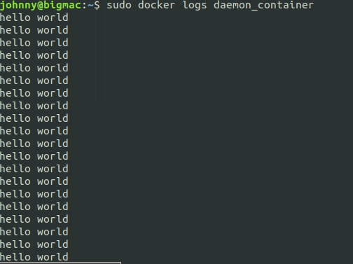
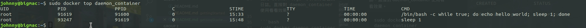
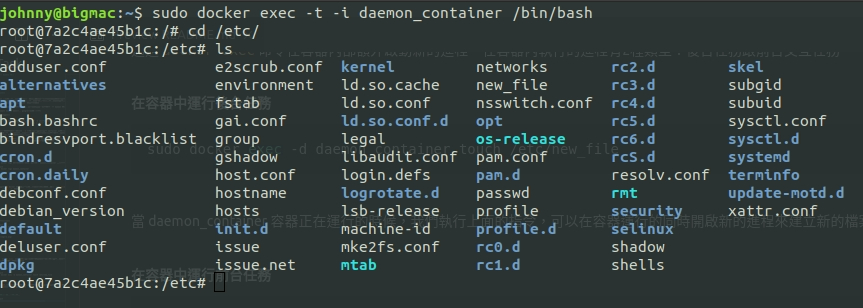

# daemon 容器

<br>

---

<br>


## Daemon
<br>

daemon 對寫過多執行緒的人來說是一很不陌生的名詞，以防有人不知道，這邊還是在多解釋一下。daemon 執行緒就是附屬於主執行緒的"守衛"，在主執行緒沒有結束任務中止後，所有附屬的 daemon Thread 都會一併結束消失。

在這邊的 daemon 我們可以理解為背景作業。這裡將介紹開啟一個 daemon 容器在背景執行。
(還不理解 daemon 的請自行 google，弄懂再回來)

執行以下指令：

```bash
sudo docker run --name daemon_container -d ubuntu /bin/bash -c "while true; do echo hello world; sleep 1; done"
```


這邊沒看過得參數應該就只有 `-d`，正是這個指令讓這個 container 變成在後台運行，也就是你在執行之後並不會感覺到他在跑，事實上他已經在後台啟動執行了。這在未來介紹到起 server 服務的時候會經常用到。

後面的指令應該不難看出就是隔一秒印一次 hello world。當確認好容器被成功運行之後，要怎麼知道現在容器內部都發生什麼呢？接下來就要介紹了。

<br>
<br>
<br>
<br>

## `logs` 查看容器內部日誌

<br>

使用 docker logs 可以取得容器的日誌。直接對 daemon_container 使用看看效果。

```bash
sudo docker logs daemon_container
```

結果：



<br>

這個指令是讓 docker 返回最後幾條日誌，要想完全追蹤日誌就在 `sudo docker logs` 後面加 `-f` 參數：

```bash
sudo docker logs -f daemon_container
```


<br>
<br>
<br>
<br>

## `top` 查看容器內部任務

<br>

執行以下命令：

```bash
sudo docker top daemon_container
```

結果：



<br>
<br>
<br>
<br>

## `exec` 在容器內部啟動新的 Task

<br>

通過 `docker exec` 命令在容器內部額外啟動新的進程。在容器內執行的進程有2種類型：後台任務跟前台交互任務。

<br>

__在容器中運行後台任務__

```bash
sudo docker exec -d daemon_container touch /etc/new_file
```

<br>

當 daemon_container 容器正在運行的時候，我們執行上面的指令，可以在容器運行的同時開啟新的進程來建立新的檔案。

<br>

__在容器中運行前台任務__

```bash
sudo docker exec -t -i daemon_container /bin/bash
```

看一下指令大概也能看出來，是在容器前台起一個 bash 指令交互界面（事實上在現在的 docker 文件中，docker 開發者們已經不推薦使用 `attach` 指令來附著容器了，使用這種方法比較優）。開啟指令交互界面借讓我們檢查一下上面的新檔案有沒有被確實建立：



<br>

看到 new_file 就沒問題了。

<br>
<br>
<br>
<br>

## `stop` 停止容器

<br>

```bash
sudo docker stop daemon_container
```

`docker stop` 會讓 container 正常離開，如果沒有正常關閉（遇 bug 關不掉）可以用 `docker kill` 來強行關閉。

<br>
<br>
<br>
<br>

## `inspect` 取得更多容器資訊

<br>

要想取得完整的 container 資訊，可以使用 `docker inspect` 指令。這邊演示就不貼了，資訊展開太多。

```bash
sudo docker inspect daemon_container    
```

<br>
<br>
<br>
<br>

## `rm` 刪除容器

<br>

刪除容器指令：

```bash
sudo docker rm daemon_container
```

<br>

一口氣刪除所有 container 的方法：

```bash
sudo docker rm `sudo docker ps -a -q`
```
