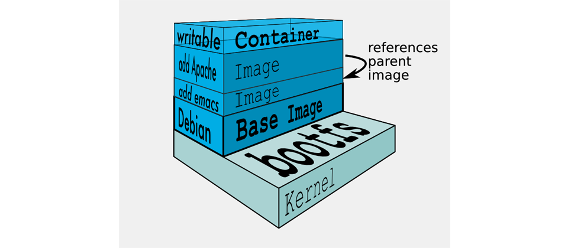

# Docker 鏡像

 

---

 

## 鏡像介紹

 

關於鏡像結構，看下面這一張圖會就夠了。

 

說實話，第一次看到這張圖配上各種版本的解說還是完全沒概念。但是真正玩過一段時間 docker 之後，會發現 docker 鏡像真的就跟這張圖一樣簡單明瞭。如果是新學 docker 的話，建議這邊先看過就好，不理解沒關係，之後重新回來看一遍這張圖就好。

Docker 是由文件系統疊加而成，最底端視引導文件系統（bootfs）。基本上我們作為 docker 的使用者是不會跟引導文件系統有任何關係的。

第二層是 root 文件系統（rootfs），位於引導文件系統之上。他可以是多種 OS （CentOS丶RedHat丶Ubuntu）

再來第三層開始就是我們需要的應用程式了。一個鏡像可以放到另一個鏡像的頂部。

 
 

## 目錄

 

* [列出鏡像 `images`](images)

* [查找鏡像 `search`](search)

* [拉取鏡像 `pull`](pull)

* [建構鏡像 （ 使用 Dockerfile ）](dockerfile)

