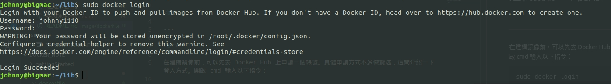

# 建構鏡像 （ 使用 Dockerfile ）

<br>

---

<br>

在建構鏡像前，可以先去 Docker Hub 上申請一個帳號。具體申請方式不多做贅述，這間介紹一下登入方式。開啟 cmd 輸入以下指令：

```bash
sudo docker login
```

<br>



<br>

如果要登出的話，可以輸入 `sudo docker logout`。

<br>
<br>

---

<br>
<br>

Docker 建構鏡像的方法大致上分為 2 種，一種是用 docker commit，但是這種方法官方已經不推薦使用了。現在比較常用的是 Dockerfile 來建構鏡像。以下不會提到 docker commit 用法，這裡專注於介紹基於 Dockerfile 建構。

<br>

之前提到過，對 java 工程師來說，Dockerfile 就好比是 `.java` 檔，鏡像就好比 `.class` 檔， 容器就是被 jvm run 起來 java 程式。這樣理解雖然不是 100% 正確，但也是最快能讓人理解的說法了。

<br>
<br>

## 建立第一個 Dockerfile

<br>

先準備一個測試用的資料夾，然後如下操作：

```sh
$ mkdir static_web
$ cd static_web/
$ touch Dockerfile
```

<br>

接下來要編輯 Dockerfile 了，不管用 vim nano 還是其他，都可以。編輯內容如下：

```Dockerfile
# 基底鏡像是 ubuntu:20.04 必須要指定基底鏡像
FROM ubuntu:20.04
# 可選填，作者聯絡資訊
MAINTAINER Johnny Wang "Jarvan1110@gmail.com"
# apt-get install 有時候要輸入 y 來繼續，設定 noninteractive 可以預設 y
ENV UBUNTU_FRONTEND noninteractive
# 時間標記，用處之後會講
ENV UPDATED_AT 2020-12-11
# 建構步驟，以 nginx 為例，這邊故意輸入錯，方便作 debug 示範
RUN apt-get update && apt-get install -yqq nginxxxx
RUN echo 'I am a static web.' > /usr/share/nginx/html/index.html
# 指定容器使用 80 port，這並不代表可以直接從主機上直接 localhost:80 來訪問，還要作映射設定
EXPOSE 80
```

<br>

Dockerfile 由指令與參數構成，指令就如 `FROM`丶`MAINTAINER`丶`ENV`丶`RUN` 等等，都必須為大寫，且後面都要跟參數。Dockerfile 的指令會按從上到下的順序執行，所以指令編排順序非常重要。

<br>

仔細看過這個 Dockerfile 之後應該不難注意到這邊故意把 nginx 打成 nginxxxx，因為等一下要示範建構失敗要怎麼處理。

<br>

Dockerfile 在建構最終鏡像之前對每一行的指令都會創建一個新的鏡像，然後對剛創建的鏡像再運行一個容器，依次類推直到所有指令都成功執行完畢。這樣做的好處是我們可以在中途某一個指令壞掉的時候 `docker exec` 進入那一步產出的臨時容器進行 debug。

<br>
<br>


現在就開始建構鏡像吧！

```sh
cd static_web
sudo docker build -t="johnny1110/stataic_web" .
```

<br>

輸入以上指令應該會慨到如下 console：


