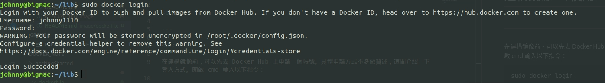
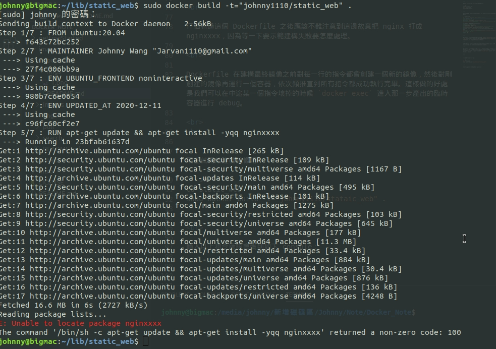
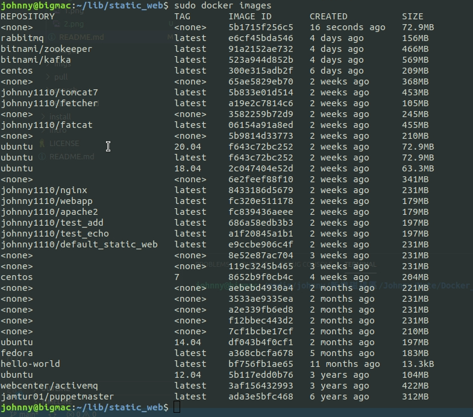
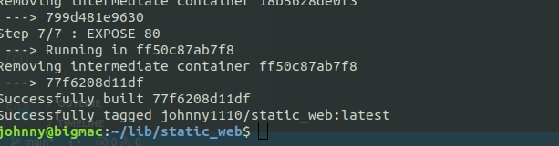
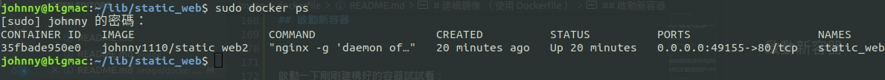

# 建構鏡像 （ 使用 Dockerfile ）

<br>

---

<br>

在建構鏡像前，可以先去 Docker Hub 上申請一個帳號。具體申請方式不多做贅述，這間介紹一下登入方式。開啟 cmd 輸入以下指令：

```bash
sudo docker login
```

<br>



<br>

如果要登出的話，可以輸入 `sudo docker logout`。

<br>
<br>

---

<br>
<br>

Docker 建構鏡像的方法大致上分為 2 種，一種是用 docker commit，但是這種方法官方已經不推薦使用了。現在比較常用的是 Dockerfile 來建構鏡像。以下不會提到 docker commit 用法，這裡專注於介紹基於 Dockerfile 建構。

<br>

之前提到過，對 java 工程師來說，Dockerfile 就好比是 `.java` 檔，鏡像就好比 `.class` 檔， 容器就是被 jvm run 起來 java 程式。這樣理解雖然不是 100% 正確，但也是最快能讓人理解的說法了。

<br>
<br>

## 建立第一個 Dockerfile

<br>

先準備一個測試用的資料夾，然後如下操作：

```sh
$ mkdir static_web
$ cd static_web/
$ touch Dockerfile
```

<br>

接下來要編輯 Dockerfile 了，不管用 vim nano 還是其他，都可以。編輯內容如下：

```Dockerfile
# 基底鏡像是 ubuntu:20.04 必須要指定基底鏡像
FROM ubuntu:20.04
# 可選填，作者聯絡資訊
MAINTAINER Johnny Wang "Jarvan1110@gmail.com"
# apt-get install 有時候要輸入 y 來繼續，設定 noninteractive 可以預設 y
ENV UBUNTU_FRONTEND noninteractive
# 時間標記，用處之後會講
ENV UPDATED_AT 2020-12-11
# 建構步驟，以 nginx 為例，這邊故意輸入錯，方便作 debug 示範
RUN apt-get update && apt-get install -yqq nginxxxx
RUN echo 'I am a static web.' > /var/www/html/index.html
# 指定容器使用 80 port，這並不代表可以直接從主機上直接 localhost:80 來訪問，還要作映射設定
EXPOSE 80
```

<br>

Dockerfile 由指令與參數構成，指令就如 `FROM`丶`MAINTAINER`丶`ENV`丶`RUN` 等等，都必須為大寫，且後面都要跟參數。Dockerfile 的指令會按從上到下的順序執行，所以指令編排順序非常重要。

<br>

仔細看過這個 Dockerfile 之後應該不難注意到這邊故意把 nginx 打成 nginxxxx，因為等一下要示範建構失敗要怎麼處理。

<br>

Dockerfile 在建構最終鏡像之前對每一行的指令都會創建一個新的鏡像，然後對剛創建的鏡像再運行一個容器，以此類推直到所有指令都成功執行完畢。這樣做的好處是我們可以在中途某一個指令壞掉的時候 `docker exec` 進入那一步產出的臨時容器進行 debug。

<br>
<br>


現在就開始建構鏡像吧！

```sh
cd static_web
sudo docker build -t="johnny1110/static_web" .
```

<br>

輸入以上指令應該會慨到如下 console：



<br>

結果說我們 install 那一行指令執行錯誤。建構鏡像時不免會遇到這種類似的問題，接下來就花點時間 debug 一下。

<br>

首先先來看一看鏡像：



看到最上面有一個沒有名字的的 image （\<none\>），這個鏡像就是在建構 static_web 時 docker 所建立的臨時鏡像，目前卡在 install 步驟沒執行，所以我們要把這個鏡像 run 起來，然後跑跑看指令看哪邊有問題。

<br>

輸入以下指令，讓臨時鏡像實例化成容器：

```bash
sudo docker run -it 5b1715f256c5 /bin/bash
```

<br>

進入容器之後就跑跑看執行失敗的指令，把問題找出來，回去修復 Dockerfile。

<br>
修改 Dockerfile，把有問題的那一行修改如下：

```dockerfile
RUN apt-get update && apt-get install -yqq nginx
```

<br>

重新執行建構過後應該要看到 success 提示：



<br>
<br>

## Dockerfile 的建構跟緩存

<br>

docker 在以 Dockerfile 建構鏡像時，存在一個緩存機制。假如我們在之前的建構範例中第五行失敗了，修正好後重新執行建構指令時，前四行不會再被重新執行，而是以之前的建構緩存直接從第五行開始建構。

<br>

如果我們不希望重新建構時使用緩存有三種作法。

<br>

* 第一種：

    建構鏡像時使用 `--no-cache` 參數，像這樣： `sudo docker build --no-cache -t="johnny1110/static_web" .`

* 第二種：

    把臨時鏡像刪掉，像這樣：`sudo docker rmi -f <臨時鏡像ID>` 然後從新 build 鏡像。

* 第三種：

    Dockerfile 緩存機制可以理解為，從第一個被發現有異動的行數開始繼續建構，也就是說，如果今天我們在 Dockerfile 的 `ENV UPDATED_AT 2020-12-11` 稍微改一下，那麼後面所有的指令即使沒異動沒出錯都會被重新建構。

<br>
<br>

## 啟動新容器

<br>

啟動一下剛剛建構好的容器試試看：

```bash
sudo docker run -d -p 80 --name static_web johnny1110/static_web nginx -g "daemon off;"
```

這邊還是要稍微解釋一下參數：

* `-d` 背景執行

* `-p 80` 用來標示 docker 在運行時該公開哪寫 port，直接指定 80 並不代表我們在主機上訪問 localhost:80 可以連到容器內的 nginx 伺服器。直接指定 80 port 的意思是隨機在主機上找一個 32759~61000 的 port 映射到容器的 80 port 上。

* `nginx -g "daemon off;"` nginx 的指令，以前景作業方式啟動。

<br>

啟動容器成功之後，我們要須要查看一下隨機選中了那一個 port 號來映射容器 80 port

```bash
sudo docker ps 
```



<br>

看到 PORTS 部份，本機端 0.0.0.0：49155 映射到容器 80 port。所以我們知道了 nginx 起在了本機 49155 port 上。

<br>

訪問看看 49155：


```bash
curl localhost:49155
```

<br>
<br>

## `-p` 選項映射到特定 port

<br>

* `-p 8080:80`  容器的 80 port 綁定到 localhost 的 8080 port

* `-p 127.0.0.1:8080:80` 容器的 80 port 綁定到本機端 127.0.0.1 這個 IP。

* `-p 127.0.0.1::80` 容器的 80 port 綁定到本機端 127.0.0.1 這個 IP 的隨機一個 port

* `-p` 當初建構 Dockerfile 時 `EXPORT` 指定的 port 在這邊就派的上用場。Dockerfile 指定開放那個 port 這邊就開放那個。

