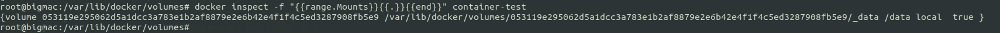
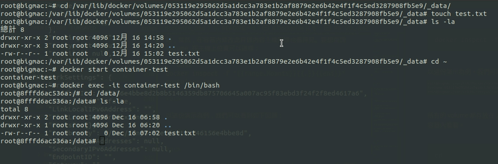
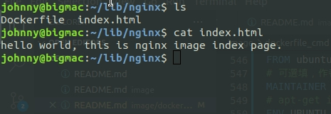
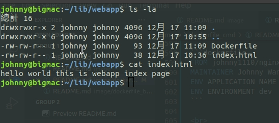
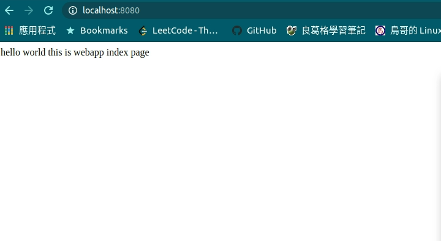

# Dockerfile 指令

<br>

---

<br>

這里會詳細列舉出 Dockerfile 的指令，可以把這邊當作是 Dockerfile 指令字典，需要時可以回來看一看。

<br>

## 目錄

<br>

* [`CMD`](#1)

* [`ENTRYPOINT`](#2)

* [`WORKDIR`](#3)

* [`ENV`](#4)

* [`USER`](#5)

* [`VOLUME`](#6)

* [`ADD`](#7)

* [`COPY`](#8)

* [`LABEL`](#9)

* [`STOPSIGNAL`](#10)

* [`ARG`](#11)

* [`ONBUILD`](#12)

<br>
<br>

---

<br>
<br>

<div id="1">

## `CMD`

<br>

`CMD` 的作用跟使用 `docker run` 命令啟動容器時指定命令類似。例如：

```bash
sudo docker run -it johnny1110/static_web /bin/bash
```

可以在 Dockerfile 這樣設定：

```dockerfile
CMD ["/bin/bash"]
```

如果要傳遞參數可以這樣做（多說一句，這跟　java ProcessBuilder 處理方式很像）：

```dockerfile
CMD ["/bin/bash", "-l"]
```

__使用 `docker run` 指令可以覆蓋 `CMD` 指令__，如果 Dockerfile 有 `CMD`，`docker run` 時也指定命令，此時會以後者為主。

Dockerfile 中只能指定一條 `CMD` 指令，如果指定了多條，會以最後一條為主。

<br>
<br>

---

<br>
<br>

<div id="2">

## `ENTRYPOINT`

<br>

`ENTRYPOINT` 跟 `CMD` 也很像，但又不一樣。使用方式如下：

在 Dockerfile 中編寫以下命令：

```dockerfile
ENTRYPOINT ["/usr/sbin/nginx"]
```

建構好鏡像後，使用 `docker run` 啟動容器方法如下：

```bash
sudo docker run -it johnny1110/static_web -g "daemon off;"
```

這次我們就不必去指定 nginx 了，只要把 nginx 啟動需要的參數傳入即可。

<br>
<br>

也可以把 `ENTRYPOINT` 當作 `CMD` 來用

```dockerfile
ENTRYPOINT ["/usr/sbin/nginx", "-g", "daemon off;"]
```

這樣一來啟動器時連參數都不用再給了。

<br>
<br>

`ENTRYPOINT` 與 `CMD` 可以並用，例如：

```dockerfile
ENTRYPOINT ["/usr/sbin/nginx"]
CMD ["-h"]
```

當我們這樣設定時，使用 `docker run` 時如果不傳入參數，預設就會是 `-h`（help），如果 `docker run` 指定了參數當然就用我們要傳入的參數了。


<br>
<br>

---

<br>
<br>

<div id="3">

## `WORKDIR`

<br>

`WORKDIR` 用來指定建構鏡像時的工作目錄（就是你 `cd` 到哪裡）。例如：

```dockerfile
WORKDIR /tmp
RUN touch test.txt
WORKDIR /opt
RUN touch test2.txt
```

應該看就懂什麼意思。其實就是 `cd` 指令。

<br>

`docker run` 時也可以用 `-w` 來指定 WORKDIR，同時也可以覆蓋運行時的工作目錄：

```bash
sudo docker run -it -w /var/log ubuntu pwd
```


<br>
<br>

---

<br>
<br>

<div id="4">

## `ENV`

<br>

`ENV` 指令用來設定環境變數，這個被設定的環境變數可以被之後的所有 `RUN` 指令使用。就像是在命令前指定環境變數一樣


我們先設定一個環境變數：

```dockerfile
ENV JAVA_PATH C:/dev/java/jdk13
```

然後在下面一行 `RUN` 一個指令：

```dockerfile
RUN java -jar test.jar
```

<br>

在容器的角度看來整體就會像這樣：

```dockerfile
JAVA_PATH="C:/dev/java/jdk13" java -jar test.jar
```

<br>

`ENV` 也可以一次指定多個環境變數：

```dockerfile
ENV JAVA_PATH="C://dev/java/jdk13" MAVEN_PATH="C://dev/maven"
```

<br>

在其他 Dockerfile 指令中使用環境變量：

```dockerfile
ENV TARGET_DIR /opt/app
WORKDIR $TARGET_DIR
```

第二行的 `WORKDIR $TARGET_DIR` 等價於 `WORKDIR /opt/app`。

<br>

如果我們 `docker exec` 進入容器內，輸入 `env` 查看環境變數一樣也可以找到我們在 Dockerfile 的環境變數相關設定。

<br>

可以在 `docker run` 指令中加入環境變量設定。

```dockerfile
sudo docker run -it -e "WEB_PORT=8080" ubuntu env
```

<br>
<br>

---

<br>
<br>

<div id="5">

## `USER`

<br>

docker 預設使用 root 帳號來運行，我們可以使用 `USER` 指令來切換使用者。

```dockerfile
USER username
```

<br>
<br>

---

<br>
<br>

<div id="6">

## `VOLUME`

<br>

volume 的觀念對 docker 來說非常重要，這在後面會單獨抽出來做詳細解釋，這邊看過去有點印象就可以了，之後也可以回來翻一下查看用法。

<br>

這邊簡單提一下 volume 的作用，有使用過 linux 的人應該都熟悉（`mount`）掛載這一個概念，可以把其他硬碟掛載到任意一個空資料夾。volume 跟掛載有點像，可以把主機上的資料夾共享給容器，也可以讓多容器共用同一個主機上的資料夾。

<br>

這邊詳細列出 volume 的作用：

* volume 可以在容器間共享重複使用。

* 一個容器可以不必跟其他容器共享 volume。

* 在主機上對 volume 作修改可以立即對容器生效。

* volumne 會一直存在並被 docker 記錄直到沒有容器使用它。

* 如果不想把一些重要資訊（例如 source code）建構到鏡像中，可以使用 volume。

<br>

或許還是有點不太好理解，這裡直接舉一個例子說明。假設我們今天架設了一個帶有 nginx 服務的容器，如果我們要對 nginx 的靜態頁面更新照理說應該要把新做好的文件想方設法搬進容器內再部屬，如果使用 volume，把 nginx 靜態文件配置路徑設定成 volume（綁定主機資料夾），這樣一來我們啟動容器後就不必在去動容器了，有靜態文件更新直接去主機上綁定的資料夾更新資料就沒問題了。

<br>

在 `docker run` 指令中，可以用 `-v` 來宣告 volume：

```bash
sudo docker run -it --name container-test -v /data ubuntu /bin/bash
```

上面的 `-v` 命令會將 `/data` 掛載到容器內，我們可以在主機上操作此目錄，當然，在容器內修改此目錄內容主機同樣也看得見。要想查詢 volume 在主機上位置可以這樣：

```bash
docker inspect -f "{{range.Mounts}}{{.}}{{end}}" container-test
```
<br>

以這份演示為例，我們可以看到如下回應：



<br>

所有的 volume 都存放在 `/var/lib/docker/volumes/` 下面。我們可以測試看看在 `/data` 裡面加入一個自訂文件，然後 `docker exec` 進入容器內看看。

<br>



<br>


<br>

在 Dockerfile 中指定 volume：

```dockerfile
VOLUME ["/data"]
```

<br>
<br>
<br>

另外還要提到一點 `-v` 能做到但是 Dockerfile 做不到的事情，就是 `-v` __可以指定 volume 綁定的主機自訂資料夾__，像下面這樣：

```bash
docker run -v /home/johnny/lib/data:/data ubuntu ls /data
```

<br>

這樣做有一點要注意，__主機上的資料夾內容永遠會覆蓋容器內資料夾 !__，既使主機的資料夾是空的甚至不存在，容器內的資料夾也會被清空。並不存在說主動把容器內的資料掛到外面來的說法。

<br>

這樣一來本機的 `/home/johnny/lib/data` 資料夾就綁定到容器內的 `/data` 了。

<br>

網路上可能會比較常看到一些花式用法比如 ：

```bash
docker run -v $(pwd):/data ubuntu ls /data
```

<br>

pwd 不用多說大家應該也知道，就是目前的工作目錄，起到的作用跟上面也一樣。

<br>

最後補充一點，一個容器要訪問另一個容器正在使用的 volume 方法可以像這樣：

```bash
docker run -it --volumes-from container-test --name test2 ubuntu /bin/bash
```

<br>

以上就是對 volume 的簡單介紹，之後會找一個章節更加詳細的補充。

<br>
<br>

---

<br>
<br>

<div id="7">

## `ADD`

<br>

`ADD` 指令用來將主機建構目錄下的文件複製到鏡像中。在 Dockerfile 可以這樣：

```dockerfile
ADD test.txt /root/test.txt
```

這裡 `ADD` 指令會將當前建構目錄下的 `test.txt` 檔案（或目錄）複製到鏡像中 `/root/test.txt`。

<br>

__注意重點：__ 在 `ADD` 文件時，Docker 通過目的地址結尾處的字符來判斷，不管是 src 還是 dest，如果目標地址以 `/` 結尾的，那麼 docker 就會認為要複製的是一個目錄，否則就是文件。

<br>

還有一點要補充，就是 `ADD` 指令會自動解壓縮，例如：

```dockerfile
ADD bag.tar.gz /var/www/wordpress/
```

這條命令會把壓縮檔 `bag.tar.gz` 的內容解壓縮到 `/var/www/wordpress/`

<br>
<br>

---

<br>
<br>

<div id="8">

## `COPY`

<br>

`COPY` 指令類似 `ADD`，不同的是，`COPY` 不會雞婆的幫你解壓縮：

```dockerfile
COPY conf.d /etc/apache2/
```

這個指令會把當前建構目錄下的 `conf.d` 檔案複製到鏡像中的 `/etc/apache2/` 目錄下。

<br>
<br>

---

<br>
<br>

<div id="9">

## `LABEL`

<br>

`LABEL` 指令用於為 docker 添加 metadata，以下作幾個示範：

```dockerfile
LABEL version="1.0"
LABEL location="TAIWAN" type="Data Center" role="Web Server"
```

<br>

可以使用 `docker inspect` 來查看容器 label 資訊，這邊就不多做演示了。

<br>
<br>

---

<br>
<br>

<div id="10">

## `STOPSIGNAL`

<br>

`STOPSIGNAL` 用來要停止容器時發送什麼系統信號給容器。

<br>
<br>

---

<br>
<br>

<div id="11">

## `ARG`

<br>

`ARG` 指令可以在 `docker build` 命令運行時給建構 runtime 的變量，當我們建構鏡像時使用 `--build-arg` 就可以了，我們只能在建構時指定 Dockerfile 文件中定義好的參數：

```dockerfile
ARG build
ARG webapp_user=johnny
```

<br>

第二行 `webapp_user` 被指定了一個預設值，如果在使用建構指令 `docker build ` 時沒有為他指定值就會使用 `johnny` 這個預設時。

<br>

在 `docker build` 時指定建構變數：

```bash
docker build --build-arg build=1111 -t johnny1110/webapp .
```

<br>

這樣一來在建構 runtime 就會有 2 個參數了。 build = 1111 且 webapp_user = johnny

<br>
<br>

---

<br>
<br>

<div id="12">

## `ONBUILD` 

<br>

`ONBUILD` 指令的作用是當一個鏡像被用來當作其他鏡像的基礎鏡像時，那被當作基礎鏡像的 `ONBUILD` 就將被觸發。

<br>
<br>
<br>

以防忘記，這邊簡單重述一下什麼是基礎鏡像假設我們今天要建立一個 Dockerfile:

```dockerfile
FROM ubuntu:20.04
...
```

<br>

第一行我們用 `FROM` 其實就是在指定基礎鏡像，意思是我們現在的這個鏡像是要基於 ubuntu:20.04 鏡像來建立。

<br>
<br>
<br>

要想快速了解 `ONBUILD` 的作用是什麼，直接用實做的方式介紹最直接：

<br>

我們新建一個資料夾名為 nginx 在資料夾內為 nginx 鏡像建構一個 Dockerfile，其中加入了 `ONBUILD` 指令。具體內容如下：

<br>

```dockerfile
# 基底鏡像是 ubuntu:20.04 必須要指定基底鏡像
FROM ubuntu:20.04
# 可選填，作者聯絡資訊
MAINTAINER Johnny Wang "Jarvan1110@gmail.com"
# apt-get install 有時候要輸入 y 來繼續，設定 noninteractive 可以預設 y
ENV UBUNTU_FRONTEND noninteractive
# 時間標記，用處之後會講
ENV UPDATED_AT 2020-12-17
# 建構步驟，以 nginx 為例，這邊故意輸入錯，方便作 debug 示範
RUN apt-get update && apt-get install -yqq nginx
# ONBUILD 建立觸發器
ONBUILD ADD . /var/www/html/
# 指定容器使用 80 port，這並不代表可以直接從主機上直接 localhost:80 來訪問，還要作映射設定
EXPOSE 80
ENTRYPOINT ["nginx"]
```

<br>

編寫好 Dockerfile 之後繼續在同一層資料夾中建立一個 index.html，內容隨便打，最後需要看到如下畫面才算完成。



<br>

接下來建構這個鏡像：

```cmd
sudo docker build -t="johnny1110/nginx" . 
```

<br>

建構完成，此時可以把這個鏡像運行起來進入內部看看，找一下 `/var/www/html/` 資料夾內是否有 index.html 的存在。這邊沒有實際示範，但是可以很負責任的說，我們並不能看到 index.html 出現。因為 `ONBUILD` 指令並不是服務於本身這個鏡像的，而是其子鏡像。

<br>

為了驗證 `ONBUILD` 的作用，我們建立一個 `johnny1110/nginx` 的子鏡像。

建立一個新的資料夾，名稱為 webapp，並建立 Dockerfile 與 index.html：


```bash
mkdir webapp
cd webapp
touch Dockerfile
touch index.html
```

<br>

編輯 Dockerfile，內容如下：

```dockerfile
FROM johnny1110/nginx
MAINTAINER Johnny Wang
ENV APPLICATION_NAME webapp
ENV ENVIRONMENT dev
```

<br>

index.html 內容也隨便打，最後檢查一下大概會像下面這樣：



<br>
<br>

一切都沒問題，接下來就是把他建構成鏡像了：

```bash
sudo docker build -t="johnny1110/webapp" .
```

<br>

建構好後，執行此鏡像：

```bash
sudo docker run -d -p 8080:80 --name=webapp johnny1110/webapp -g "daemon off;"
```

<br>

完成後使用瀏覽器或 `curl` 訪問 `localhost:8080`：



<br>

通過實做應該會比較好理解 `ONBUILD` 的作用，但是要注意的是，`ONBUILD` 只能作用於子鏡像，至於孫子輩的鏡像是吃不到 `ONBUILD` 的。
