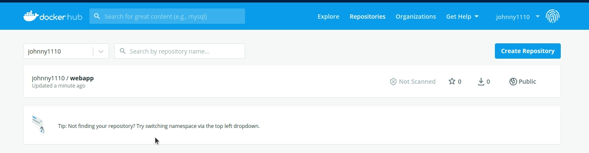

# 推送鏡像到 Docker Hub

<br>

---

<br>


當我們建構好鏡像之後，可以把它上傳至 Docker Hub 上，這樣一來其他人就可以跟你共享這個鏡像了。（這邊只介紹免費的公開倉庫，docker hub 私有倉庫要收費）

<br>
<br>

## `docker push`

<br>

`docker push` 是推送鏡像的指令，假如我們要推送我們製作的 web_app 鏡像，如果還未登入請先使用 `docker login` 指令登入：

```bash
sudo docker push johnny1110/webapp
```

<br>

這個 webapp 是上一個章節就已經建立過的，如果沒有實做上一個章節，這邊可以隨便建構一個鏡像來跟著實做。

<br>

推送好後，去到 Docker Hub 官網登入自己的帳號就可以看到剛剛上傳的 docker 鏡像了：



<br>

此時可以就可以通知其他 coworker 的夥伴去把你的鏡像 pull 下來運行了，找一台新的 PC 或者新的環境試著 pull 一下：

```bash
sudo docker pull johnny1110/webapp
```

<br>

pull 下來之後，我們再試著啟動看看：

```bash
sudo docker run -d -p 8080:80 johnny1110/webapp -g "daemon off;"
```

<br>
<br>


