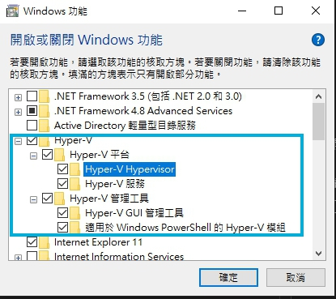

# Docker 下載安裝

 

---

 

Docker 經歷了很多次版本改動，許多書上或者網路上講解的方法都已經被淘汰了，最正確的安裝方法還是要以 Docker 官方文件為主。畢竟官方文件是隨時跟著版本更新的。

請參考這邊，我就不裝會在寫教學了 （- <_ -|||

https://docs.docker.com/engine/install/

 

這裡唯一需要注意的就是 Winodws 上安裝使用比較特別，這邊會專門說明。

 

---

 

## Docker Desktop 在 Winodws 上安裝

 

* 安專必要環境

    * Windows 10 專業版丶教育版丶企業版，Windows Server 2016 以上以及 64 位元（因為要開　Hyper-V）

    * BIOS 硬體虛擬化

    * WSL2 （Windows Subsystem for Linux 2）

     

 
 

## 開啟 Windows 必要功能

 

首先開啟 __控制台 > 程式集 > 開啟或關閉 Windows 功能__。開啟 Hyper-V 全部功能

 

另外還需要開啟 WSL 以及虛擬化平台 2 個功能:

 

完成以上設定後重新啟動電腦。進入 BIOS 開啟硬體虛擬化支援，由於不同廠商的主機板開啟的位置跟方法都不一樣所以這邊就不演示了，要想知道是否已經開啟硬體虛擬化支援也很簡單， <kbd>ctrl</kbd> + <kbd>Alt</kbd> + <kbd>Del</kbd> 開啟工作管理員。點選 __效能 > CPU__ :

 

看到模擬那邊顯示已啟用就沒問題了。

 
 

## 下載 Docker Desktop 

 

Docker Desktop 可以在 Docker Hub 上下載， [鏈結點這裡](https://hub.docker.com/editions/community/docker-ce-desktop-windows/)。 下載好後直接安裝即可。

如果主機上的 WSL 版本不是第 2 版的話，Docker Desktop 會顯示啟動失敗要手動安裝 WSL2，這個時候再[點這裡](http://aka.ms/wsl2kernelmsix64)下載 WSL 2 進行安裝，安裝好後重啟 Docker Desktop 就沒問題了。

 
 

## 啟動測試

安裝好後直接來測試看看。直接開啟一個 cmd 來 run 一個 ubuntu 基底鏡像

 
 

大功告成