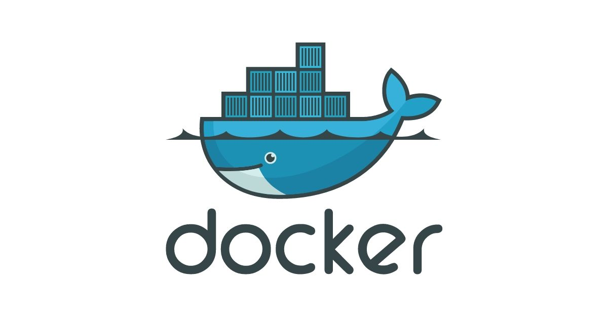

# Docker 簡介

 

這邊並不會以一個非常專業套很多專有名詞的畫來介紹 Docker，畢竟也沒看多多少東習還在摸索學習。所以就嘗試用自己的話來敘述一下 Docker 對應用開發者們的幫助與好處。這裡也不會以網管的角度去探討。

 

 

首先要說的是，Docker 是一個能把開發的應用程式自動部屬到容器的開源引擎。其最核心的價值在於解決同樣的 code 部屬到不同機器就沒辦法跑的問題。縮短開發，測試，部屬到上線的週期。使我們寫的程式具備高度可移植性，易於建構部屬。是程式開發者與網路管理人員都應該學習使用的一套工具。

 
 

## Docker 鏡像與容器 （image＆container）

 

鏡像是 Docker 的核心，Docker 的容器全部是基於鏡像所建立。我們可以直接使用 DockerHub 上被妥善管理的第三方鏡像，或者自己打造鏡像。

用 java 開發者的角度去理解，可以把鏡像想像成 .class 檔，由我們自己編寫的 Dockerfile 編譯而成。容器跟鏡像的關係就是 class 與 object。容器是鏡像的實例化（不知道這樣解釋妥不妥當，反正我覺得沒問題）

這邊還是寫一下對應關係好了，加快理解：

    Dockerfile >> .java

    image >> .class

    container >> object

 
 

## Registry

Registry 用來保存鏡像，可以分成公有跟私有兩種，Docker 官方開放了一個公有的 Registry 叫做 Docker Hub，建議可以先去註冊一個。大家可以在上面分享保存自己的鏡像。而且我們開發中大多數常用的軟體服務都在 Docker Hub 有鏡像，私有 Registry 部份這裡不會提到。

大家可能會覺得他像是 github，確實概念上像，但是我覺得他更像是 maven repo。(無腦拉下來直接用)

 
 

## Docker 能做什麼？

* 加快開發建構流程，開發人員可以建構運行並分享 Docker 容器，容器可以在開發環境中建構然後、提交到測試環境測試，最後進入生產環境。搬移得時候不用再煩惱版本，OS 或者環境變數問題。

* 讓獨立的服務或程式在不同環境可以得到相同運行結果。

* 用 Docker 可以快速建立一個隔離環境來測試。

* 可以讓開發者在本機上先進行複雜架構測試，不用一開始就在生產環境部屬測試，因為在你自己電腦上能 work，就代表其他任何的電腦都能 work。

* 提供一個輕量級獨立的乾淨環境，可以用於搭建某技術研究實驗環境。

